# Documentation Overview

This folder contains architecture documentation, decision records, and deployment guides for the ASP.NET Core DataLayer API solution.

## 🎯 Start Here

**New to this project?** Start with the **[Deployment Strategy](deployment-strategy.md)** document. It provides the complete strategic overview and explains how all other documents fit together.

## 📚 Document Hierarchy

### Strategic Documents (Start Here)

1. **[Deployment Strategy](deployment-strategy.md)** ⭐ **START HERE**
   - Overall architectural strategy and vision
   - Progressive approach from non-production to production
   - Decision criteria for deployment models
   - Implementation roadmap and timeline

### Architecture Decision Records (ADRs)

Architecture decisions are documented in the [`adr/`](adr/) folder:

#### Active ADRs (Current Strategy)

- **[ADR 0004: Progressive Deployment Strategy](adr/0004-progressive-deployment-strategy.md)**
  - Evidence-based approach using non-production monitoring
  - Rationale for progressive evolution from consolidated to hybrid architecture

- **[ADR 0005: Hybrid Production Architecture](adr/0005-hybrid-production-architecture.md)**
  - Production deployment combining consolidated (lazy APIs) and independent (greedy APIs) approaches
  - Decision criteria and classification rules
  - Implementation details

- **[ADR 0003: Use Private Endpoints Only (No Application Gateway)](adr/0003-use-private-endpoints-only-no-application-gateway.md)**
  - Network architecture decision
  - Why Application Gateway was rejected
  - Private Endpoint implementation approach

#### Reference ADRs

- **[ADR 0001: Deploy Each Project as Independent Azure App Service](adr/0001-deploy-each-project-as-independent-app-service.md)**
  - Independent deployment model
  - Used for "greedy" APIs in hybrid architecture

- **[ADR 0002: Use Regular App Service with Application Gateway](adr/0002-use-regular-app-service-with-application-gateway.md)**
  - Superseded by ADR 0003
  - Retained for historical reference

#### Superseded ADRs

- **[ADR 0006: Deploy Entire Solution as Single App Service](adr/0006-deploy-entire-solution-as-single-app-service.md)**
  - Rejected approach
  - Retained for historical context

- **[ADR 0007: Use Azure App Service Deployment Slots](adr/0007-use-azure-app-service-deployment-slots.md)**
  - Rejected approach
  - Retained for historical context

- **[ADR 0008: Use ILB App Service Environment](adr/0008-use-ilb-app-service-environment.md)**
  - Rejected approach
  - Retained for historical context

### Technical Architecture Documents

#### Selected Architectures (Implemented)

- **[App Service Private Endpoint Architecture](app-service-private-endpoint-architecture.md)**
  - Network architecture for all deployments
  - VNet configuration, Private DNS, NSG rules
  - Applies to both consolidated and independent deployments

- **[Consolidated Deployment Architecture](consolidated-deployment-architecture.md)**
  - Detailed architecture for consolidated deployments
  - Used for lazy APIs and non-production environment
  - Project structure and development workflow

#### Reference Architectures (Not Implemented)

- **[App Service Application Gateway Architecture](app-service-application-gateway-architecture.md)**
  - ⚠️ **NOT SELECTED** - Reference only
  - Alternative architecture that was evaluated and rejected
  - See ADR 0003 for rejection rationale

### Infrastructure Documents

- **[Azure Resource Requirements - Non-Production](azure-resource-requirements-nonprod.md)**
  - Fully consolidated deployment for testing and data collection
  - Resource specifications for non-production environment
  - Comprehensive monitoring configuration
  - Cost: ~$227-312/month

- **[Azure Resource Requirements - Production](azure-resource-requirements-prod.md)**
  - Hybrid deployment (consolidated + independent) based on performance data
  - Data-driven API placement decisions
  - Resource specifications for production environment
  - Cost: ~$571-1,431/month (28-62% savings vs fully independent)

## 🗺️ Architecture Overview

### Current Strategy Summary

```mermaid
%%{init: {'theme':'base', 'themeVariables': { 'primaryColor':'#fff','primaryBorderColor':'#000','lineColor':'#000'}}}%%
flowchart TD
    subgraph Wrapper[" "]
        Strategy["<b>DEPLOYMENT STRATEGY</b>"]
        
        Phase1["<b>PHASE 1: NON-PRODUCTION</b><br/>• Fully consolidated deployment<br/>• All APIs in single App Service<br/>• Comprehensive monitoring (100% sampling)<br/>• Duration: 3-6 months<br/>• Goal: Identify greedy vs lazy APIs"]
        
        Analysis["Evidence-based analysis"]
        
        Phase2["<b>PHASE 2: PRODUCTION (HYBRID ARCHITECTURE)</b>"]
        Phase2Lazy["<b>Consolidated App Service (Lazy APIs)</b><br/>• Examples, Products, Categories, etc.<br/>• CPU < 30%, Memory < 40%, Low request rate<br/>• Cost-effective resource sharing"]
        Phase2Greedy["<b>Independent App Services (Greedy APIs)</b><br/>• Orders, Customers (if greedy)<br/>• CPU > 60%, Memory > 70%, High request rate<br/>• Isolated for performance"]
        Phase2Network["<b>Network & Cost</b><br/>• Private Endpoints + VPN Gateway (all deployments)<br/>• Cost Savings: 28-62% vs fully independent"]
        
        Monitoring["Continuous monitoring"]
        
        Phase3["<b>PHASE 3: CONTINUOUS OPTIMIZATION</b><br/>• Monthly architecture reviews<br/>• API reclassification as needed<br/>• Cost and performance optimization"]
        
        Strategy --> Phase1
        Phase1 --> Analysis
        Analysis --> Phase2
        Phase2 --> Phase2Lazy
        Phase2 --> Phase2Greedy
        Phase2 --> Phase2Network
        Phase2Lazy --> Monitoring
        Phase2Greedy --> Monitoring
        Phase2Network --> Monitoring
        Monitoring --> Phase3
    end
    
    style Wrapper fill:#fff,stroke:#000,stroke-width:2px
    style Strategy fill:#E3F2FD,stroke:#0D47A1,stroke-width:2px
    style Phase1 fill:#BBDEFB,stroke:#1E88E5,stroke-width:2px
    style Analysis fill:#E3F2FD,stroke:#64B5F6,stroke-width:1px
    style Phase2 fill:#BBDEFB,stroke:#1E88E5,stroke-width:2px
    style Phase2Lazy fill:#64B5F6,stroke:#1E88E5,stroke-width:2px
    style Phase2Greedy fill:#64B5F6,stroke:#1E88E5,stroke-width:2px
    style Phase2Network fill:#64B5F6,stroke:#1E88E5,stroke-width:2px
    style Monitoring fill:#E3F2FD,stroke:#64B5F6,stroke-width:1px
    style Phase3 fill:#BBDEFB,stroke:#1E88E5,stroke-width:2px
```

### Key Concepts

| Term | Definition |
|------|------------|
| **Lazy API** | API with low resource consumption (CPU < 30%, Memory < 40%) suitable for consolidated deployment |
| **Greedy API** | API with high resource consumption (CPU > 60%, Memory > 70%) requiring independent deployment |
| **Consolidated Deployment** | Multiple APIs sharing a single App Service (cost-effective for lazy APIs) |
| **Independent Deployment** | Single API in dedicated App Service (necessary for greedy APIs) |
| **Hybrid Architecture** | Production approach combining consolidated and independent deployments based on evidence |
| **Progressive Strategy** | Evidence-based evolution from consolidated non-production to optimized production |

## 📖 Reading Paths

### Path 1: I'm New - Understanding the Strategy

1. [Deployment Strategy](deployment-strategy.md) - Complete overview
2. [ADR 0004: Progressive Deployment Strategy](adr/0004-progressive-deployment-strategy.md) - Why this approach
3. [ADR 0005: Hybrid Production Architecture](adr/0005-hybrid-production-architecture.md) - Production implementation

### Path 2: I'm Implementing Non-Production

1. [Deployment Strategy - Phase 1](deployment-strategy.md#phase-1-non-production-environment-consolidated--monitoring)
2. [Azure Resource Requirements - Non-Production](azure-resource-requirements-nonprod.md) - Complete deployment guide
3. [Consolidated Deployment Architecture](consolidated-deployment-architecture.md) - Technical details
4. [App Service Private Endpoint Architecture](app-service-private-endpoint-architecture.md) - Network setup
5. [Deployment Strategy - Monitoring](deployment-strategy.md#monitoring-and-decision-criteria) - Monitoring configuration

### Path 3: I'm Implementing Production

1. [Deployment Strategy - Phase 2](deployment-strategy.md#phase-2-production-environment-hybrid-architecture)
2. [Azure Resource Requirements - Production](azure-resource-requirements-prod.md) - Complete deployment guide
4. [Consolidated Deployment Architecture](consolidated-deployment-architecture.md) - For lazy APIs
5. [ADR 0001: Independent Deployment](adr/0001-deploy-each-project-as-independent-app-service.md) - For greedy APIs
6. [ADR 0001: Independent Deployment](adr/0001-deploy-each-project-as-independent-app-service.md) - For greedy APIs
5. [App Service Private Endpoint Architecture](app-service-private-endpoint-architecture.md) - Network for all deployments

### Path 4: I Need to Classify an API

1. [Deployment Strategy - Decision Criteria](deployment-strategy.md#monitoring-and-decision-criteria)
2. [ADR 0005 - Deployment Rules](adr/0005-hybrid-production-architecture.md#deployment-rules)
3. [Deployment Strategy - Decision Framework](deployment-strategy.md#decision-framework)

### Path 5: I'm Working on Network Architecture

1. [ADR 0003: Use Private Endpoints Only](adr/0003-use-private-endpoints-only-no-application-gateway.md) - Network decision
2. [App Service Private Endpoint Architecture](app-service-private-endpoint-architecture.md) - Complete network design
3. [Azure Resource Requirements - Non-Production](azure-resource-requirements-nonprod.md) - Non-prod infrastructure
4. [Azure Resource Requirements - Production](azure-resource-requirements-prod.md) - Production infrastructure

## 🔄 Document Status Legend

- **Active**: Currently implemented and in use
- **Accepted**: Decision made and being implemented
- **Proposed**: Under consideration, not yet implemented
- **Superseded**: Replaced by newer decision
- **Rejected**: Evaluated but not selected
- **Reference Only**: Retained for historical context

## 📋 Quick Reference

### Cost Comparison

| Deployment Model | Monthly Cost (10 APIs) | Use Case |
|------------------|------------------------|----------|
| **Non-Production (Fully Consolidated)** | $227-312 | Initial monitoring phase |
| **Production (Hybrid: 8+2)** | $571-1,431 | **Selected approach** - Based on evidence |
| **Fully Independent** | $1,500-2,000 | If most/all APIs are greedy |
| **Fully Consolidated** | $227-467 | If all APIs are lazy (unlikely) |

### Network Configuration

- **VNet**: 172.18.121.0/24
- **Private Endpoint Subnet**: 172.18.121.160/27 (27 IPs)
- **VNet Integration Subnet**: 172.18.121.192/26 (59 IPs)
- **Connectivity**: Site-to-Site VPN Gateway (existing)
- **DNS**: Private DNS zones for *.azurewebsites.net resolution

## 🤝 Contributing

When adding new documentation:

1. **Update this README** to include the new document
2. **Create cross-links** in related documents
3. **Follow naming conventions**:
   - ADRs: `####-brief-description.md`
   - Architecture docs: `descriptive-name-architecture.md`
4. **Include status** and date in all documents
5. **Link to related documents** in each document's header

## 📞 Questions?

- Architecture questions: Review [Deployment Strategy](deployment-strategy.md)
- Decision rationale: Check relevant ADR in [`adr/`](adr/) folder
- Network questions: See [App Service Private Endpoint Architecture](app-service-private-endpoint-architecture.md)
- Cost questions: See [Deployment Strategy - Cost Analysis](deployment-strategy.md#cost-analysis)

---

**Last Updated**: 2026-01-30  
**Document Owner**: Architecture Team
