# App Service Private Endpoint Architecture

## Document Information

**Date**: 2026-01-30  
**Status**: Active  
**Architecture Type**: Private Endpoints Only (Internal-Only Access)  
**Usage**: Network architecture for both consolidated and independent App Service deployments  
**Related Documentation**: 
- [Deployment Strategy](deployment-strategy.md) - **START HERE** - Overall strategic approach
- [ADR 0004: Progressive Deployment Strategy](adr/0004-progressive-deployment-strategy.md) - Evidence-based deployment approach
- [ADR 0005: Hybrid Production Architecture](adr/0005-hybrid-production-architecture.md) - Production deployment model
- [ADR 0003: Use Private Endpoints Only (No Application Gateway)](adr/0003-use-private-endpoints-only-no-application-gateway.md) - Network architecture decision
- [Consolidated Deployment Architecture](consolidated-deployment-architecture.md) - Consolidated deployment for lazy APIs
- [Azure Resource Requirements](azure-resource-requirements.md) - Infrastructure specifications

## Executive Summary

This document describes the Private Endpoints network architecture used for all Azure App Service deployments (both consolidated and independent). The architecture eliminates the Application Gateway layer in favor of direct Private Endpoint access, reducing costs by $250-400/month while maintaining full security for trusted, internal-only traffic.

**Key Characteristics**:
- **Access Pattern**: Direct Private Endpoint access via `app-{name}-api-{env}.azurewebsites.net`
- **Security Model**: Azure AD/OAuth 2.0 authentication, NSG rules, Private DNS resolution
- **Deployment Flexibility**: Supports both consolidated (lazy APIs) and independent (greedy APIs) deployments
- **Scale**: Capacity for 20+ total deployments
- **Connectivity**: Site-to-Site VPN Gateway (existing, operational)

**Cost Examples**:
- **Non-Production** (Fully Consolidated): $227-312/month
- **Production** (Hybrid: 8 consolidated + 2 independent): $571-1,431/month
- **Savings vs Fully Independent**: 28-85% depending on deployment model

## Table of Contents

1. [Architecture Overview](#architecture-overview)
2. [Design Principles](#design-principles)
3. [Network Architecture](#network-architecture)
4. [Component Details](#component-details)
5. [Traffic Flows](#traffic-flows)
6. [Security Architecture](#security-architecture)
7. [High Availability and Resilience](#high-availability-and-resilience)
8. [Monitoring and Observability](#monitoring-and-observability)
9. [Operational Considerations](#operational-considerations)
10. [Future Growth](#future-growth)

---

## Architecture Overview

### High-Level Architecture

```mermaid
%%{init: {'theme':'base', 'themeVariables': { 'primaryColor':'#fff','primaryBorderColor':'#000','lineColor':'#000'}}}%%
graph TB
    subgraph Wrapper[" "]
        subgraph OnPrem["On-Premises Network"]
            direction TB
            ClientApps["Client Apps<br/>(Using DLL)"]
            LOBApps["Line-of-Business<br/>Applications"]
        end
        
        OnPrem -->|"HTTPS/443<br/>Site-to-Site VPN"| VPNGateway["VPN Gateway"]
        
        subgraph AzureVNet["Azure Virtual Network<br/>172.18.121.0/24 (256 IPs)"]
            direction TB
            
            subgraph DNS["Private DNS Resolution"]
                DNSInfo["privatelink.azurewebsites.net<br/>→ 172.18.121.160-187"]
            end
            
            subgraph BusinessLayer["Business Layer - Available<br/>172.18.121.0/25 (123 IPs)"]
                BLInfo["Reserved for:<br/>AKS, Databricks, App Gateway, etc."]
            end
            
            subgraph ReservedBlock["Reserved Block<br/>172.18.121.128/27 (27 IPs)"]
                RBInfo["Future medium services"]
            end
            
            subgraph PESubnet["Private Endpoint Subnet<br/>172.18.121.160/27 [EXISTING]"]
                direction LR
                PE1["PE: App<br/>Service 1"]
                PE2["PE: Cosmos<br/>DB"]
                PE3["PE: Azure<br/>SQL"]
                PEMore["...<br/>(10-20+)"]
                
                PE1 ~~~ PE2 ~~~ PE3 ~~~ PEMore
            end
            
            subgraph VNetIntSubnet["VNet Integration Subnet<br/>172.18.121.192/26 (59 IPs)"]
                direction TB
                subgraph AppServices["App Services"]
                    direction LR
                    AS1["App Service<br/>(Examples)"]
                    AS2["App Service<br/>(Orders)"]
                    AS3["App Service<br/>(Customers)"]
                    ASMore["...<br/>(10-20+)"]
                    
                    AS1 ~~~ AS2 ~~~ AS3 ~~~ ASMore
                end
                OutboundNote["Outbound: Access Cosmos DB, SQL,<br/>Key Vault via Private Endpoints"]
            end
            
            subgraph SharedServices["Shared Services"]
                direction TB
                KV["Key Vault<br/>(certificates, secrets)"]
                AI["Application Insights<br/>(telemetry)"]
                LA["Log Analytics<br/>(logs, metrics)"]
            end
            
            AS1 & AS2 & AS3 --> PE1 & PE2 & PE3
        end
        
        VPNGateway --> PESubnet
        PESubnet --> VNetIntSubnet
    end
    
    style Wrapper fill:#fff,stroke:#000,stroke-width:2px
    style OnPrem fill:#E3F2FD,stroke:#0D47A1,stroke-width:2px
    style AzureVNet fill:#E3F2FD,stroke:#0D47A1,stroke-width:3px
    style DNS fill:#BBDEFB,stroke:#0D47A1,stroke-width:2px
    style BusinessLayer fill:#BBDEFB,stroke:#0D47A1,stroke-width:2px
    style ReservedBlock fill:#BBDEFB,stroke:#0D47A1,stroke-width:2px
    style PESubnet fill:#BBDEFB,stroke:#0D47A1,stroke-width:2px
    style VNetIntSubnet fill:#BBDEFB,stroke:#0D47A1,stroke-width:2px
    style SharedServices fill:#BBDEFB,stroke:#0D47A1,stroke-width:2px
    style AppServices fill:#64B5F6,stroke:#0D47A1,stroke-width:2px
    style PE1 fill:#1E88E5,stroke:#0D47A1,stroke-width:1px,color:#fff
    style PE2 fill:#1E88E5,stroke:#0D47A1,stroke-width:1px,color:#fff
    style PE3 fill:#1E88E5,stroke:#0D47A1,stroke-width:1px,color:#fff
    style PEMore fill:#1E88E5,stroke:#0D47A1,stroke-width:1px,color:#fff
    style AS1 fill:#1E88E5,stroke:#0D47A1,stroke-width:1px,color:#fff
    style AS2 fill:#1E88E5,stroke:#0D47A1,stroke-width:1px,color:#fff
    style AS3 fill:#1E88E5,stroke:#0D47A1,stroke-width:1px,color:#fff
    style ASMore fill:#1E88E5,stroke:#0D47A1,stroke-width:1px,color:#fff
    style ClientApps fill:#64B5F6,stroke:#0D47A1,stroke-width:1px,color:#000
    style LOBApps fill:#64B5F6,stroke:#0D47A1,stroke-width:1px,color:#000
    style VPNGateway fill:#1E88E5,stroke:#0D47A1,stroke-width:2px,color:#fff
    style DNSInfo fill:#64B5F6,stroke:#0D47A1,stroke-width:1px,color:#000
    style BLInfo fill:#64B5F6,stroke:#0D47A1,stroke-width:1px,color:#000
    style RBInfo fill:#64B5F6,stroke:#0D47A1,stroke-width:1px,color:#000
    style OutboundNote fill:#64B5F6,stroke:#0D47A1,stroke-width:1px,color:#000
    style KV fill:#1E88E5,stroke:#0D47A1,stroke-width:1px,color:#fff
    style AI fill:#1E88E5,stroke:#0D47A1,stroke-width:1px,color:#fff
    style LA fill:#1E88E5,stroke:#0D47A1,stroke-width:1px,color:#fff
```



### Architecture Components

| Component | Purpose | Quantity |
|-----------|---------|----------|
| **App Services** | Host .NET 8 REST APIs | 10 initially, 20+ capacity |
| **App Service Plans** | Compute resources (Premium V3 P1V3) | 2-3 plans |
| **Private Endpoints** | Inbound connectivity to App Services | 10-20+ endpoints |
| **VNet Integration** | Outbound connectivity from App Services | Single /26 subnet |
| **Private DNS Zones** | Internal DNS resolution | 3 zones (existing) |
| **Key Vault** | Secrets and certificate management | 1 instance |
| **Application Insights** | Application telemetry | 1 instance |
| **Log Analytics** | Centralized logging | 1 workspace |
| **VPN Gateway** | Site-to-Site connectivity | 1 gateway (existing) |

---

## Design Principles

### 1. Internal-Only Access

**Principle**: All APIs are accessible only from trusted on-premises networks via VPN Gateway.

**Implementation**:
- No public internet access to App Services
- Private Endpoints provide inbound connectivity
- Azure-managed certificates for `*.azurewebsites.net` domains
- Private DNS resolution ensures internal routing

**Rationale**: 100% of traffic originates from trusted sources (corporate network), eliminating the need for WAF and public-facing components.

### 2. API Independence

**Principle**: Each API project is deployed as an independent Azure App Service.

**Implementation**:
- Separate App Service per API project
- Independent deployment pipelines
- Shared infrastructure (App Service Plans, monitoring)
- Isolated failure domains

**Benefits**:
- Independent scaling per API
- Isolated deployments (no cascading failures)
- Technology flexibility (different .NET versions if needed)
- Clear ownership and accountability

**Reference**: [ADR 0001](adr/0001-deploy-each-project-as-independent-app-service.md)

### 3. Client DLL Encapsulation

**Principle**: Client applications use a shared DLL that encapsulates all API hostnames and routing logic.

**Implementation**:
- DLL provides unified interface: `ApiClient.Examples.GetAll()`
- DLL manages hostname resolution: `app-examples-api-{env}.azurewebsites.net`
- On-premises applications don't need to know backend URLs
- Environment-specific configuration injected at deployment

**Benefits**:
- No need for single unified hostname (Application Gateway unnecessary)
- Simplified client code
- Centralized hostname management
- Easy to add/remove APIs without client changes

### 4. Defense-in-Depth Security

**Principle**: Multiple layers of security compensate for lack of WAF.

**Implementation**:
- Azure AD / OAuth 2.0 authentication on all APIs
- Network Security Groups (NSG) restrict traffic
- Private DNS prevents external resolution
- API-level rate limiting and input validation
- TLS 1.2+ encryption everywhere
- Managed identities for service-to-service authentication

**Reference**: [ADR 0003 - Security Considerations](adr/0003-use-private-endpoints-only-no-application-gateway.md)

### 5. Cost Optimization

**Principle**: Eliminate unnecessary components while maintaining security and functionality.

**Decision**: Remove Application Gateway layer.

**Savings**:
- **$250-400/month** by eliminating Application Gateway
- Total cost: **$530-980/month** (vs $780-1,380 with App Gateway)

**Trade-offs Accepted**:
- No single unified hostname (mitigated by client DLL)
- No WAF (mitigated by Azure AD authentication and trusted source traffic)
- No advanced routing (not needed for stateless APIs)

**Reference**: [ADR 0003](adr/0003-use-private-endpoints-only-no-application-gateway.md)

---

## Network Architecture

### IP Address Space

**Total Allocation**: `172.18.121.0/24` (256 total IPs, 251 usable after Azure reservation)

#### Subnet Design

| Subnet | CIDR | Usable IPs | Status | Purpose |
|--------|------|------------|--------|---------|
| **Business Layer** | `172.18.121.0/25` | 123 | Available | Reserved for large services (AKS, Databricks, Firewall) |
| **Reserved** | `172.18.121.128/27` | 27 | Available | Reserved for future medium services |
| **Private Endpoints** | `172.18.121.160/27` | 27 | **Active** | Private Endpoints for App Services, Cosmos DB, SQL, Key Vault |
| **VNet Integration** | `172.18.121.192/26` | 59 | **Active** | App Service outbound connectivity to backend resources |

**Design Rationale**:
- **Consolidated Available Space**: Entire first half (.0/25) kept as single 123-IP block for maximum flexibility
- **Private Endpoints**: Pre-emptively expanded from /28 to /27 to support 20+ APIs
- **VNet Integration**: Single /26 subnet (59 IPs) sufficient for 20+ APIs with connection pooling
- **Growth Capacity**: 150 IPs available for future services

### IP Consumption Patterns

#### Private Endpoints
- **Usage**: 1 IP per Private Endpoint (exact)
- **Current**: ~10 endpoints (App Services + Cosmos DB + SQL + Key Vault)
- **Capacity**: 27 endpoints (20+ APIs with room for additional backend services)

#### VNet Integration
- **Usage**: 1-3 IPs per App Service instance under load
- **Connection Pooling**: Reduces actual IP consumption
- **Current**: 10 APIs × 2-3 instances × 2-3 IPs = ~40-90 theoretical IPs
- **Actual**: ~20-40 IPs with connection pooling and typical workloads
- **Capacity**: 59 IPs sufficient for 20+ APIs

### Network Security Groups

#### NSG: snet-integration

**Purpose**: Control traffic for App Services using VNet Integration

**Key Rules**:

| Priority | Name | Direction | Source | Destination | Port | Action |
|----------|------|-----------|--------|-------------|------|--------|
| 100 | Allow-PrivateEndpoints | Outbound | Any | 172.18.121.160/27 | 443, 1433 | Allow |
| 110 | Allow-Internet-Outbound | Outbound | Any | Internet | * | Allow |
| 65000 | Default-Deny | Outbound | Any | Any | * | Deny |

**Rationale**:
- App Services need outbound access to Private Endpoints (Cosmos DB, SQL, Key Vault)
- Internet access required for Azure services (Microsoft Entra ID, ARM, etc.)
- Default deny for defense-in-depth

### Private DNS Configuration

**Existing Configuration** (operational):

| DNS Zone | Purpose | Example Record |
|----------|---------|----------------|
| `privatelink.azurewebsites.net` | App Service Private Endpoints | `app-examples-api-prod.privatelink.azurewebsites.net` → `172.18.121.16X` |
| `privatelink.documents.azure.com` | Cosmos DB Private Endpoints | `cosmos-apis-prod.privatelink.documents.azure.com` → `172.18.121.16X` |
| `privatelink.database.windows.net` | Azure SQL Private Endpoints | `sql-apis-prod.privatelink.database.windows.net` → `172.18.121.16X` |
| `privatelink.vaultcore.azure.net` | Key Vault Private Endpoints | `kv-apis-prod.privatelink.vaultcore.azure.net` → `172.18.121.16X` |

**Resolution Flow**:
1. Client queries `app-examples-api-prod.azurewebsites.net`
2. On-premises DNS forwards to Azure DNS (conditional forwarding configured)
3. Azure Private DNS Zone resolves to Private Endpoint IP (`172.18.121.160-187`)
4. Traffic routes through VPN Gateway to Private Endpoint
5. Private Endpoint forwards to App Service

### Routing Architecture

**Traffic Path**: `On-Premises → VPN Gateway → Private DNS → Private Endpoint → App Service`

#### Inbound Flow (Client → API)

```mermaid
%%{init: {'theme':'base', 'themeVariables': { 'primaryColor':'#fff','primaryBorderColor':'#000','lineColor':'#000'}}}%%
flowchart TD
    subgraph Wrapper[" "]
        OnPremApp["On-Premises App"]
        PrivateDNS["Private DNS Zone<br/>(Azure-managed)"]
        VPNGateway["VPN Gateway"]
        PrivateEndpoint["Private Endpoint<br/>(172.18.121.160-187)"]
        AppService["App Service<br/>(app-examples-api-prod)"]
        
        OnPremApp -->|"1. DNS Query:<br/>app-examples-api-prod.azurewebsites.net"| PrivateDNS
        PrivateDNS -->|"2. Resolves to<br/>172.18.121.16X"| VPNGateway
        VPNGateway -->|"3. HTTPS/443"| VPNGateway2["VPN Gateway"]
        VPNGateway2 -->|"4. Routes to VNet"| PrivateEndpoint
        PrivateEndpoint -->|"5. Forwards to<br/>App Service"| AppService
        AppService -->|"6. Processes request"| AppService
    end
    
    style Wrapper fill:#fff,stroke:#000,stroke-width:2px
    style OnPremApp fill:#E3F2FD,stroke:#0D47A1,stroke-width:2px
    style PrivateDNS fill:#BBDEFB,stroke:#0D47A1,stroke-width:2px
    style VPNGateway fill:#BBDEFB,stroke:#0D47A1,stroke-width:2px
    style VPNGateway2 fill:#BBDEFB,stroke:#0D47A1,stroke-width:2px
    style PrivateEndpoint fill:#64B5F6,stroke:#0D47A1,stroke-width:2px,color:#000
    style AppService fill:#1E88E5,stroke:#0D47A1,stroke-width:2px,color:#fff
```



#### Outbound Flow (API → Backend)

```mermaid
%%{init: {'theme':'base', 'themeVariables': { 'primaryColor':'#fff','primaryBorderColor':'#000','lineColor':'#000'}}}%%
flowchart TD
    subgraph Wrapper[" "]
        AppService["App Service<br/>(VNet Integration)"]
        PrivateDNS["Private DNS Zone"]
        VNetSubnet["VNet Integration Subnet<br/>(172.18.121.192/26)"]
        PrivateEndpoint["Private Endpoint<br/>(Cosmos DB)"]
        CosmosDB["Cosmos DB"]
        
        AppService -->|"1. Needs data from<br/>Cosmos DB"| AppService2["App Service"]
        AppService2 -->|"2. DNS Query:<br/>cosmos-apis-prod.documents.azure.com"| PrivateDNS
        PrivateDNS -->|"3. Resolves to<br/>172.18.121.16X"| VNetSubnet
        VNetSubnet -->|"4. HTTPS/443"| VNetSubnet2["VNet Integration Subnet"]
        VNetSubnet2 -->|"5. Routes via VNet"| PrivateEndpoint
        PrivateEndpoint -->|"6. Forwards to<br/>Cosmos DB"| CosmosDB
        CosmosDB -->|"7. Returns data"| CosmosDB
    end
    
    style Wrapper fill:#fff,stroke:#000,stroke-width:2px
    style AppService fill:#E3F2FD,stroke:#0D47A1,stroke-width:2px
    style AppService2 fill:#E3F2FD,stroke:#0D47A1,stroke-width:2px
    style PrivateDNS fill:#BBDEFB,stroke:#0D47A1,stroke-width:2px
    style VNetSubnet fill:#BBDEFB,stroke:#0D47A1,stroke-width:2px
    style VNetSubnet2 fill:#BBDEFB,stroke:#0D47A1,stroke-width:2px
    style PrivateEndpoint fill:#64B5F6,stroke:#0D47A1,stroke-width:2px,color:#000
    style CosmosDB fill:#1E88E5,stroke:#0D47A1,stroke-width:2px,color:#fff
```



---

## Component Details

### App Services

**Configuration**:
- **Runtime**: .NET 8 (LTS)
- **Hosting**: Azure App Service (PaaS)
- **Tier**: Premium V3 (P1V3) for production
- **Instances**: 2-3 per App Service Plan (auto-scaling enabled)
- **Deployment**: Independent CI/CD per API

**App Service Naming Convention**:
- Pattern: `app-{api-name}-api-{env}`
- Examples:
  - `app-examples-api-prod`
  - `app-orders-api-prod`
  - `app-customers-api-prod`

**Configuration Management**:
- **Application Settings**: Stored in Azure App Service configuration
- **Secrets**: Retrieved from Key Vault via Managed Identity
- **Connection Strings**: Key Vault references (e.g., `@Microsoft.KeyVault(SecretUri=...)`)
- **Environment Variables**: Injected at deployment time

**Managed Identity**:
- **Type**: System-assigned managed identity per App Service
- **Purpose**: Authenticate to Key Vault, Cosmos DB, SQL without storing credentials
- **Permissions**: Least-privilege RBAC roles assigned per service

### App Service Plans

**Strategy**: Shared plans for cost efficiency

**Configuration**:
- **Plan 1**: `asp-apis-prod` - Hosts APIs 1-5
- **Plan 2**: `asp-apis-prod-2` - Hosts APIs 6-10
- **Plan 3** (future): `asp-apis-prod-3` - Hosts APIs 11-15

**Sizing**:
- **Development**: B1 Basic (1 core, 1.75 GB RAM)
- **Staging**: S1 Standard (1 core, 1.75 GB RAM)
- **Production**: P1V3 Premium (2 cores, 8 GB RAM)

**Auto-Scaling**:
- **Minimum instances**: 2 (high availability)
- **Maximum instances**: 10
- **Scale-out rules**: CPU > 70% for 5 minutes
- **Scale-in rules**: CPU < 30% for 10 minutes

### Private Endpoints

**Purpose**: Provide private IP addresses for App Services within the VNet

**Configuration**:
- **Subnet**: `172.18.121.160/27`
- **Capacity**: 27 Private Endpoints
- **Network Policy**: Disabled (required for Private Endpoints)
- **DNS Integration**: Automatic (uses existing Private DNS zones)

**Private Endpoint per App Service**:
- `pe-app-examples-api` → `app-examples-api-prod.azurewebsites.net`
- `pe-app-orders-api` → `app-orders-api-prod.azurewebsites.net`
- Each endpoint gets unique IP in range `172.18.121.160-187`

**Benefits**:
- No public IP exposure for App Services
- Traffic never leaves Azure backbone
- Consistent IP addressing for on-premises firewall rules
- Automatic DNS resolution via Private DNS zones

### VNet Integration

**Purpose**: Enable App Services to make outbound calls through the VNet to access Private Endpoints

**Configuration**:
- **Subnet**: `172.18.121.192/26`
- **Delegation**: `Microsoft.Web/serverFarms`
- **Route All**: Enabled (all outbound traffic routes through VNet)

**Why VNet Integration is Required**:

Without VNet Integration, App Services make outbound calls via the public internet and cannot reach Private Endpoints. VNet Integration enables:
- Access to Cosmos DB via Private Endpoint
- Access to Azure SQL via Private Endpoint
- Access to Key Vault via Private Endpoint
- Internal-only communication between App Services

**IP Consumption**:
- App Service instances dynamically allocate IPs from the subnet
- 1-3 IPs per instance under load
- Connection pooling reduces actual consumption
- 59 IPs sufficient for 20+ APIs with 2-3 instances each

### Key Vault

**Purpose**: Secure storage for certificates, secrets, and connection strings

**Configuration**:
- **Name**: `kv-apis-prod-{unique}`
- **SKU**: Standard
- **Access Model**: Azure RBAC (role-based access control)
- **Network**: Private Endpoint in `172.18.121.160/27`

**Stored Secrets**:
- Cosmos DB connection strings
- Azure SQL connection strings
- API keys for third-party services
- Certificate private keys (if needed)

**Access Control**:
- **Administrators**: Key Vault Secrets Officer role
- **App Services**: Key Vault Secrets User role (via Managed Identity)
- **No Keys**: App Services use Managed Identity, not connection strings

**Integration with App Services**:
```json
{
  "ConnectionStrings:CosmosDb": "@Microsoft.KeyVault(SecretUri=https://kv-apis-prod.vault.azure.net/secrets/cosmos-connection-string)"
}
```

### Application Insights

**Purpose**: Application performance monitoring and telemetry

**Configuration**:
- **Name**: `appi-apis-prod`
- **Type**: Workspace-based (linked to Log Analytics)
- **Sampling**: Adaptive sampling enabled (reduces costs)
- **Retention**: 90 days

**Telemetry Collected**:
- Request rates and response times
- Dependency calls (Cosmos DB, SQL, external APIs)
- Exceptions and failures
- Custom metrics and events
- User flows (if applicable)

**Integration**:
- **Connection String**: Injected via App Service application settings
- **SDK**: Application Insights SDK in .NET 8 apps
- **Auto-instrumentation**: Enabled for automatic telemetry collection

**Dashboards**:
- Live metrics stream (real-time monitoring)
- Application map (dependency visualization)
- Performance blade (slow requests, dependencies)
- Failures blade (exceptions, failed requests)

### Log Analytics Workspace

**Purpose**: Centralized logging and log queries

**Configuration**:
- **Name**: `log-apis-prod`
- **SKU**: Pay-as-you-go
- **Retention**: 30 days (default), 90 days for critical logs
- **Daily Cap**: Set limit to control costs

**Logs Collected**:
- App Service HTTP logs
- App Service application logs
- NSG flow logs
- Azure Activity logs
- Application Insights telemetry

**Common Queries**:

```kusto
// Failed requests in last 24 hours
requests
| where timestamp > ago(24h)
| where success == false
| summarize count() by name, resultCode
| order by count_ desc

// Slow dependencies (> 1 second)
dependencies
| where timestamp > ago(1h)
| where duration > 1000
| summarize avg(duration), count() by name
| order by avg_duration desc

// Exceptions by API
exceptions
| where timestamp > ago(24h)
| summarize count() by cloud_RoleName, type
| order by count_ desc
```

---

## Traffic Flows

### Flow 1: Client Request to API (Successful)

```mermaid
%%{init: {'theme':'base', 'themeVariables': { 'primaryColor':'#fff','primaryBorderColor':'#000','lineColor':'#000'}}}%%
flowchart TD
    subgraph Wrapper[" "]
        ClientApp["On-Premises<br/>Client App"]
        OnPremDNS["On-Premises DNS"]
        VPNGateway["VPN Gateway"]
        PrivateEndpointApp["Private Endpoint<br/>(pe-app-examples-api)"]
        AppService["App Service<br/>(app-examples-api-prod)"]
        CosmosDB["Cosmos DB<br/>(via Private Endpoint)"]
        PrivateEndpointReturn["Private Endpoint"]
        VPNGatewayReturn["VPN Gateway"]
        ClientAppReturn["Client App"]
        
        ClientApp -->|"1. User initiates request<br/>GET https://app-examples-api-prod.azurewebsites.net/api/examples"| ClientApp2["Client DLL"]
        ClientApp2 -->|"2. Resolves hostname<br/>(app-examples-api-prod.azurewebsites.net)"| OnPremDNS
        OnPremDNS -->|"3. Conditional forwarder<br/>→ Azure DNS"| AzureDNS["Azure Private DNS"]
        AzureDNS -->|"4. Resolves to Private Endpoint IP<br/>app-examples-api-prod.privatelink.azurewebsites.net<br/>→ 172.18.121.16X"| VPNGateway
        VPNGateway -->|"5. Route traffic to<br/>Private Endpoint subnet"| PrivateEndpointApp
        PrivateEndpointApp -->|"6. HTTPS/443 (TLS 1.2+)"| PrivateEndpointApp2["Private Endpoint"]
        PrivateEndpointApp2 -->|"7. Forward to App Service"| AppService
        AppService -->|"8. Process request"| AppService2["App Service"]
        AppService2 -->|"9. Query Cosmos DB<br/>via VNet Integration"| CosmosDBDNS["Private DNS"]
        CosmosDBDNS -->|"10. Resolves Cosmos DB<br/>Private Endpoint<br/>cosmos-apis-prod.documents.azure.com<br/>→ 172.18.121.16Y"| CosmosDB
        CosmosDB -->|"11. Return data"| AppService3["App Service"]
        AppService3 -->|"12. Format response"| PrivateEndpointReturn
        PrivateEndpointReturn -->|"13. Return response<br/>to client"| VPNGatewayReturn
        VPNGatewayReturn -->|"14. Route back to<br/>on-premises"| ClientAppReturn
        ClientAppReturn -->|"15. Response received<br/>(200 OK, JSON data)"| ClientAppReturn
    end
    
    style Wrapper fill:#fff,stroke:#000,stroke-width:2px
    style ClientApp fill:#E3F2FD,stroke:#0D47A1,stroke-width:2px
    style ClientApp2 fill:#E3F2FD,stroke:#0D47A1,stroke-width:2px
    style OnPremDNS fill:#BBDEFB,stroke:#0D47A1,stroke-width:2px
    style AzureDNS fill:#BBDEFB,stroke:#0D47A1,stroke-width:2px
    style VPNGateway fill:#BBDEFB,stroke:#0D47A1,stroke-width:2px
    style PrivateEndpointApp fill:#64B5F6,stroke:#0D47A1,stroke-width:2px,color:#000
    style PrivateEndpointApp2 fill:#64B5F6,stroke:#0D47A1,stroke-width:2px,color:#000
    style AppService fill:#1E88E5,stroke:#0D47A1,stroke-width:2px,color:#fff
    style AppService2 fill:#1E88E5,stroke:#0D47A1,stroke-width:2px,color:#fff
    style AppService3 fill:#1E88E5,stroke:#0D47A1,stroke-width:2px,color:#fff
    style CosmosDBDNS fill:#BBDEFB,stroke:#0D47A1,stroke-width:2px
    style CosmosDB fill:#0D47A1,stroke:#000,stroke-width:2px,color:#fff
    style PrivateEndpointReturn fill:#64B5F6,stroke:#0D47A1,stroke-width:2px,color:#000
    style VPNGatewayReturn fill:#BBDEFB,stroke:#0D47A1,stroke-width:2px
    style ClientAppReturn fill:#E3F2FD,stroke:#0D47A1,stroke-width:2px
```



### Flow 2: API to Key Vault (Retrieve Secret)

```mermaid
%%{init: {'theme':'base', 'themeVariables': { 'primaryColor':'#fff','primaryBorderColor':'#000','lineColor':'#000'}}}%%
flowchart TD
    subgraph Wrapper[" "]
        AppService1["App Service<br/>(app-examples-api-prod)"]
        AzurePlatform["Azure Platform<br/>(ARM)"]
        VNetIntegration["VNet Integration"]
        KeyVault["Key Vault<br/>(via Private Endpoint)"]
        AppService2["App Service<br/>(app-examples-api-prod)"]
        
        AppService1 -->|"1. Application startup:<br/>Load configuration"| AppService1b["App Service"]
        AppService1b -->|"2. Resolve Key Vault reference<br/>@Microsoft.KeyVault(SecretUri=<br/>https://kv-apis-prod.vault.azure.net/<br/>secrets/cosmos-connection)"| AzurePlatform
        AzurePlatform -->|"3. Managed Identity<br/>authentication<br/>App Service presents<br/>system-assigned identity"| AzurePlatform2["Azure Platform"]
        AzurePlatform2 -->|"4. Token validated,<br/>RBAC checked<br/>Identity has 'Key Vault<br/>Secrets User' role"| VNetIntegration
        VNetIntegration -->|"5. Route via VNet to<br/>Key Vault Private Endpoint"| PrivateDNS["Private DNS"]
        PrivateDNS -->|"6. Private DNS resolves<br/>kv-apis-prod.vault.azure.net<br/>→ 172.18.121.16Z"| KeyVault
        KeyVault -->|"7. Return secret value<br/>(e.g., Cosmos DB<br/>connection string)"| AppServiceConfig["App Service<br/>Configuration"]
        AppServiceConfig -->|"8. Secret injected into<br/>App Service configuration"| AppService2
        AppService2 -->|"9. Application reads<br/>configuration<br/>CosmosDbConnectionString<br/>= [secret value]"| AppService2
    end
    
    style Wrapper fill:#fff,stroke:#000,stroke-width:2px
    style AppService1 fill:#E3F2FD,stroke:#0D47A1,stroke-width:2px
    style AppService1b fill:#E3F2FD,stroke:#0D47A1,stroke-width:2px
    style AzurePlatform fill:#BBDEFB,stroke:#0D47A1,stroke-width:2px
    style AzurePlatform2 fill:#BBDEFB,stroke:#0D47A1,stroke-width:2px
    style VNetIntegration fill:#64B5F6,stroke:#0D47A1,stroke-width:2px,color:#000
    style PrivateDNS fill:#64B5F6,stroke:#0D47A1,stroke-width:2px,color:#000
    style KeyVault fill:#1E88E5,stroke:#0D47A1,stroke-width:2px,color:#fff
    style AppServiceConfig fill:#E3F2FD,stroke:#0D47A1,stroke-width:2px
    style AppService2 fill:#E3F2FD,stroke:#0D47A1,stroke-width:2px
```



### Flow 3: Failed Authentication (Azure AD)

```mermaid
%%{init: {'theme':'base', 'themeVariables': { 'primaryColor':'#fff','primaryBorderColor':'#000','lineColor':'#000'}}}%%
flowchart TD
    subgraph Wrapper[" "]
        ClientApp1["On-Premises<br/>Client App"]
        Routing["Request Routing<br/>(steps 2-6)"]
        AppService1["App Service<br/>(app-examples-api-prod)"]
        EntraID["Microsoft Entra ID<br/>(via internet)"]
        AppService2["App Service"]
        ClientApp2["Client App"]
        
        ClientApp1 -->|"1. User initiates request<br/>WITHOUT valid token<br/>GET https://app-examples-api-prod<br/>.azurewebsites.net/api/examples<br/>Authorization: Bearer<br/>[invalid/missing token]"| Routing
        Routing -->|"2-6. Request routes to<br/>App Service (same as Flow 1)"| AppService1
        AppService1 -->|"7. Authentication middleware<br/>validates token"| AppService1b["App Service"]
        AppService1b -->|"8. Token validation against<br/>Microsoft Entra ID"| EntraID
        EntraID -->|"9. Token invalid or expired<br/>Return 401 Unauthorized"| AppService2
        AppService2 -->|"10. App Service returns<br/>error response"| ClientApp2
        ClientApp2 -->|"11. Response received<br/>(401 Unauthorized)<br/>'WWW-Authenticate: Bearer<br/>error=invalid_token'"| ClientApp2
    end
    
    style Wrapper fill:#fff,stroke:#000,stroke-width:2px
    style ClientApp1 fill:#E3F2FD,stroke:#0D47A1,stroke-width:2px
    style Routing fill:#BBDEFB,stroke:#0D47A1,stroke-width:2px
    style AppService1 fill:#64B5F6,stroke:#0D47A1,stroke-width:2px,color:#000
    style AppService1b fill:#64B5F6,stroke:#0D47A1,stroke-width:2px,color:#000
    style EntraID fill:#1E88E5,stroke:#0D47A1,stroke-width:2px,color:#fff
    style AppService2 fill:#64B5F6,stroke:#0D47A1,stroke-width:2px,color:#000
    style ClientApp2 fill:#E3F2FD,stroke:#0D47A1,stroke-width:2px
```



---

## Security Architecture

### Security Layers

#### Layer 1: Network Isolation

**Controls**:
- No public IP addresses on App Services (public access disabled)
- Private Endpoints for all inbound access
- VNet Integration for all outbound access
- On-premises connectivity via VPN Gateway only (no internet exposure)

**Threat Mitigation**:
- ✅ Internet-based attacks prevented (no public surface)
- ✅ Port scanning ineffective (no public IPs)
- ✅ DDoS attacks not applicable (internal-only)

#### Layer 2: Network Security Groups

**Controls**:
- NSG on integration subnet controls outbound traffic
- Allow-list approach: explicitly allow required traffic, deny all else
- NSG flow logs enabled for audit trail

**Threat Mitigation**:
- ✅ Lateral movement restricted (only allowed destinations accessible)
- ✅ Data exfiltration limited (outbound rules restrict destinations)
- ✅ Audit trail for forensics (NSG flow logs)

#### Layer 3: Authentication & Authorization

**Controls**:
- Azure AD / OAuth 2.0 authentication on all API endpoints
- JWT token validation (signed by Microsoft Entra ID)
- Managed identities for service-to-service authentication
- RBAC for Azure resource access

**Threat Mitigation**:
- ✅ Unauthorized access prevented (valid token required)
- ✅ Identity spoofing mitigated (cryptographic signatures)
- ✅ Credential theft not applicable (Managed Identity, no passwords)

**Implementation Example**:

```csharp
// Program.cs - Authentication configuration
builder.Services.AddAuthentication(JwtBearerDefaults.AuthenticationScheme)
    .AddMicrosoftIdentityWebApi(builder.Configuration.GetSection("AzureAd"));

builder.Services.AddAuthorization(options =>
{
    options.AddPolicy("ApiReader", policy =>
        policy.RequireClaim("roles", "Api.Read"));
});

// Controller - Enforce authorization
[Authorize(Policy = "ApiReader")]
[ApiController]
public class ExamplesController : ControllerBase
{
    // ...
}
```

#### Layer 4: Transport Security

**Controls**:
- TLS 1.2+ enforced on all connections
- Azure-managed certificates for `*.azurewebsites.net`
- HTTP Strict Transport Security (HSTS) enabled
- Certificate rotation automated by Azure

**Threat Mitigation**:
- ✅ Man-in-the-middle attacks prevented (TLS encryption)
- ✅ Eavesdropping prevented (end-to-end encryption)
- ✅ Certificate expiration not applicable (auto-renewal)

#### Layer 5: Application Security

**Controls**:
- Input validation on all API endpoints
- Output encoding to prevent injection attacks
- Rate limiting per client/API key
- CORS policies restrict allowed origins
- Dependency scanning (NuGet package vulnerabilities)

**Threat Mitigation**:
- ✅ SQL injection mitigated (parameterized queries, Cosmos DB SDK)
- ✅ XSS mitigated (API returns JSON, not HTML)
- ✅ DoS attacks limited (rate limiting, connection pooling)

**Implementation Example**:

```csharp
// Input validation with FluentValidation
public class CreateExampleValidator : AbstractValidator<CreateExampleRequest>
{
    public CreateExampleValidator()
    {
        RuleFor(x => x.Name)
            .NotEmpty()
            .MaximumLength(100)
            .Matches("^[a-zA-Z0-9-_ ]+$"); // Allow only safe characters
            
        RuleFor(x => x.Description)
            .MaximumLength(1000);
    }
}

// Rate limiting middleware
builder.Services.AddRateLimiter(options =>
{
    options.GlobalLimiter = PartitionedRateLimiter.Create<HttpContext, string>(context =>
        RateLimitPartition.GetFixedWindowLimiter(
            partitionKey: context.User.Identity?.Name ?? context.Request.Headers.Host.ToString(),
            factory: partition => new FixedWindowRateLimiterOptions
            {
                PermitLimit = 100,
                Window = TimeSpan.FromMinutes(1)
            }));
});
```

#### Layer 6: Logging & Monitoring

**Controls**:
- Application Insights telemetry on all APIs
- NSG flow logs enabled
- Azure Activity logs for control plane operations
- Log Analytics retention and queries
- Alerts for anomalous activity

**Threat Mitigation**:
- ✅ Attack detection (anomaly detection in logs)
- ✅ Forensics capability (90-day log retention)
- ✅ Compliance auditing (centralized logs)

### Comparison: Private Endpoints vs Application Gateway

| Security Control | Private Endpoints Architecture | Application Gateway Architecture |
|------------------|-------------------------------|----------------------------------|
| **WAF** | ❌ Not available | ✅ Available (OWASP rules) |
| **Network Isolation** | ✅ No public IPs | ⚠️ Public IP on App Gateway |
| **TLS Termination** | ✅ Azure-managed certs | ✅ Custom certs required |
| **Authentication** | ✅ Azure AD enforced | ✅ Azure AD enforced |
| **DDoS Protection** | ✅ Not applicable (internal) | ✅ Azure DDoS Protection |
| **Rate Limiting** | ✅ Application-level | ✅ WAF + Application |
| **Cost** | ✅ $530-980/month | ❌ $780-1,380/month |

**Compensating Controls for No WAF**:
- Azure AD authentication (all requests require valid token)
- Input validation and output encoding (application-level)
- Rate limiting per client (application-level)
- Trusted source traffic only (internal corporate network)

**When to Reconsider Application Gateway**:
- Compliance mandates WAF (e.g., PCI-DSS for payment processing)
- Untrusted client access required (external partners, mobile apps)
- Advanced routing needed (URL rewriting, path-based routing)

---

## High Availability and Resilience

### App Service High Availability

**Configuration**:
- **Multiple Instances**: 2-3 instances per App Service Plan (auto-scaling)
- **Availability Zones**: Enabled for Premium V3 plans (distribute across zones)
- **Health Checks**: `/health` endpoint on all APIs
- **Load Balancing**: Azure manages load balancing across instances

**Failure Scenarios**:

| Failure | Impact | Recovery |
|---------|--------|----------|
| Single instance failure | None (traffic routes to healthy instances) | Automatic (Azure detects and removes unhealthy instance) |
| Entire App Service Plan failure | API unavailable (if only one plan) | Deploy multiple plans in different regions (future) |
| VNet Integration subnet full | Cannot scale out new instances | Pre-allocated /26 subnet (59 IPs for 20+ APIs) |
| Private Endpoint failure | API unreachable from on-premises | Redeploy Private Endpoint (5-10 minutes) |

### Database High Availability

**Cosmos DB**:
- **Replication**: Multi-region write enabled (if configured)
- **Consistency**: Session consistency (balance between performance and consistency)
- **Backup**: Continuous backup (7-day retention)
- **Failover**: Automatic failover to secondary region

**Azure SQL Database**:
- **Tier**: General Purpose or Business Critical
- **Replication**: Geo-replication enabled (if configured)
- **Backup**: Automated backups (7-35 day retention)
- **Failover**: Automatic failover groups

### Disaster Recovery

**RTO (Recovery Time Objective)**: 1 hour  
**RPO (Recovery Point Objective)**: 15 minutes

**Backup Strategy**:
- **Cosmos DB**: Continuous backup (point-in-time restore)
- **Azure SQL**: Automated backups with geo-replication
- **App Service**: Deployment from source control (GitHub/Azure DevOps)
- **Key Vault**: Soft-delete enabled (90-day retention)

**Recovery Procedures**:

1. **App Service Failure**:
   - Identify failed App Service in Application Insights
   - Redeploy from CI/CD pipeline (5-10 minutes)
   - Verify health check endpoint

2. **Database Failure**:
   - Cosmos DB: Initiate failover to secondary region (if configured)
   - Azure SQL: Trigger failover group (automatic or manual)
   - Update connection strings in Key Vault if needed

3. **VNet/Networking Failure**:
   - Verify VPN Gateway connectivity from on-premises
   - Check NSG rules and routing tables
   - Validate Private DNS resolution
   - Recreate Private Endpoints if necessary

4. **Region Failure** (future consideration):
   - Deploy secondary region (requires architecture changes)
   - Use Traffic Manager or Front Door for multi-region routing
   - Replicate data to secondary region databases

---

## Monitoring and Observability

### Key Metrics

#### App Service Metrics

| Metric | Threshold | Alert Action |
|--------|-----------|--------------|
| **CPU Percentage** | > 80% for 10 minutes | Scale out (add instances) |
| **Memory Percentage** | > 85% for 10 minutes | Investigate memory leaks |
| **Response Time (P95)** | > 2 seconds | Investigate slow dependencies |
| **HTTP 5xx Errors** | > 10 per minute | Alert on-call engineer |
| **Request Rate** | > 1000 requests/sec | Scale out (add instances) |

#### Database Metrics (Cosmos DB)

| Metric | Threshold | Alert Action |
|--------|-----------|--------------|
| **RU Consumption** | > 80% of provisioned | Increase throughput or optimize queries |
| **Throttled Requests** | > 1% of requests | Increase RU/s or implement retry logic |
| **Latency (P99)** | > 100ms | Investigate query performance |
| **Storage Used** | > 80% of limit | Archive old data or increase storage |

#### Networking Metrics

| Metric | Threshold | Alert Action |
|--------|-----------|--------------|
| **VPN Gateway Bandwidth** | > 80% utilization | Upgrade to higher SKU |
| **Private Endpoint Connections** | > 20 endpoints | Expand subnet or optimize connectivity |
| **NSG Denied Flows** | > 100 per hour | Investigate unauthorized access attempts |

### Dashboards

**Application Insights Dashboard**:
- Live metrics stream (real-time CPU, memory, request rate)
- Application map (visualize dependencies)
- Performance blade (slow requests, dependency timing)
- Failures blade (exceptions, failed requests)
- Users/Sessions (if applicable)

**Log Analytics Dashboard**:
- Custom queries for API-specific metrics
- NSG flow logs visualization
- Azure Activity logs (control plane operations)
- Cost analysis (track spending by resource)

**Azure Portal Dashboard**:
- Resource health (green/yellow/red status per resource)
- Cost Management (daily spending, budget alerts)
- Advisor recommendations (security, performance, cost)

### Alerting Strategy

#### Critical Alerts (PagerDuty / SMS)

- All App Services returning 5xx errors (> 10/min)
- Database RU throttling (> 5%)
- VPN Gateway down
- Key Vault unavailable
- Any resource health degradation

#### Warning Alerts (Email)

- CPU > 80% for 10 minutes
- Memory > 85% for 10 minutes
- Slow response times (P95 > 2 seconds)
- High request rate (> 800 requests/sec)
- Budget threshold exceeded (> 90% of monthly budget)

#### Informational Alerts (Slack / Teams)

- New deployment completed
- Auto-scaling event (instances added/removed)
- Certificate expiring in 30 days (Azure-managed certs auto-renew)
- NSG rule changes (audit trail)

---

## Operational Considerations

### Deployment Process

**CI/CD Pipeline** (per API):

1. **Build Stage**:
   - Restore NuGet packages
   - Build .NET 8 project
   - Run unit tests
   - Run integration tests (against Cosmos DB emulator)
   - Publish artifacts

2. **Deploy to Staging**:
   - Deploy to `app-{name}-api-staging`
   - Run smoke tests
   - Run integration tests (against staging Cosmos DB)
   - Manual approval gate

3. **Deploy to Production**:
   - Deploy to `app-{name}-api-prod`
   - Use deployment slots (blue/green deployment)
   - Warm-up requests to new slot
   - Swap slots (zero downtime)
   - Monitor for errors (5-minute observation period)
   - Rollback if errors detected

**Deployment Tools**:
- **GitHub Actions**: For open-source projects
- **Azure DevOps**: For enterprise pipelines with advanced gates
- **Azure CLI**: For manual deployments (emergency only)

### Scaling Strategy

**Vertical Scaling** (increase instance size):
- **When**: CPU/memory consistently high, response times slow
- **Action**: Upgrade from P1V3 → P2V3 → P3V3
- **Downtime**: Brief restart required (~2 minutes)

**Horizontal Scaling** (increase instance count):
- **When**: High request rate, CPU > 80%
- **Action**: Auto-scale from 2 → 3 → 5 → 10 instances
- **Downtime**: None (new instances added, load distributed)

**Database Scaling**:
- **Cosmos DB**: Increase RU/s (request units) via Portal or ARM
- **Azure SQL**: Upgrade to higher tier (e.g., S3 → P1)

### Cost Management

**Cost Optimization Tips**:

1. **Reserved Instances**: Save 40% on App Service Plans with 1-year commitment
2. **Auto-Scaling**: Scale down during off-hours (nights, weekends)
3. **Right-Sizing**: Monitor CPU/memory usage, downgrade if underutilized
4. **Log Retention**: Archive old logs to cheaper storage (Blob Storage)
5. **Development Environments**: Use B-series (Basic) or S-series (Standard) SKUs

**Monthly Budget Alerts**:
- **50% threshold**: Informational email
- **75% threshold**: Warning email to engineering lead
- **90% threshold**: Critical alert, review spending

### Backup and Recovery

**Backup Schedule**:
- **Cosmos DB**: Continuous backup (automatic, 7-day retention)
- **Azure SQL**: Automated backups every 12 hours
- **App Service Code**: Stored in GitHub (source of truth)
- **Infrastructure**: ARM templates / Bicep files in Git

**Recovery Procedures**:
- **Point-in-Time Restore**: Cosmos DB → Select timestamp within 7 days
- **Geo-Restore**: Azure SQL → Restore to secondary region
- **App Service**: Redeploy from CI/CD pipeline

### Maintenance Windows

**Planned Maintenance**:
- **When**: 2nd Tuesday of month, 02:00-04:00 (low-traffic window)
- **Activities**: Azure platform updates, certificate renewals, infrastructure changes
- **Notification**: 7-day advance notice to stakeholders

**Emergency Maintenance**:
- **When**: Critical security patches, service outages
- **Approval**: Engineering lead + operations manager
- **Communication**: Incident notification to all stakeholders

---

## Future Growth

### Current Capacity

| Resource | Current | Maximum | Headroom |
|----------|---------|---------|----------|
| **APIs Deployed** | 10 | 20+ | 100%+ |
| **Private Endpoints** | 10 | 27 | 170% |
| **VNet Integration IPs** | ~20-40 | 59 | 50-200% |
| **App Service Plans** | 2 | Unlimited | N/A |
| **Business Layer IPs** | 0 | 123 | Available for large services |

### Expansion Scenarios

#### Scenario 1: Add 10 More APIs (20 total)

**Changes Required**:
- Deploy 10 additional App Services (reuse existing plans or add 1 new plan)
- Create 10 additional Private Endpoints (within existing /27 capacity)
- No subnet changes required (sufficient capacity)

**Cost Impact**: +$150-300/month (1 additional App Service Plan)

#### Scenario 2: Deploy AKS Cluster (Microservices Migration)

**Changes Required**:
- Utilize Business Layer block: 172.18.121.0/25 (123 IPs)
- Deploy AKS cluster with 3-10 nodes
- Migrate APIs to containerized microservices
- Maintain Private Endpoints for external access

**Cost Impact**: +$500-1,500/month (AKS cluster cost)

#### Scenario 3: Add Application Gateway (Requirements Change)

**Trigger**: Compliance requires WAF, or untrusted client access needed

**Changes Required**:
- Utilize Business Layer block: 172.18.121.0/26 (59 IPs for App Gateway)
- Deploy Application Gateway with WAF v2
- Configure backend pools pointing to existing Private Endpoints
- Update client DLL to use single hostname

**Cost Impact**: +$250-400/month (Application Gateway cost)

#### Scenario 4: Multi-Region Deployment

**Trigger**: Disaster recovery requirements, latency optimization

**Changes Required**:
- Deploy secondary region with identical architecture
- Configure Cosmos DB multi-region write
- Configure Azure SQL failover groups
- Deploy Azure Traffic Manager or Front Door for routing
- Replicate Key Vault secrets to secondary region

**Cost Impact**: +~100% (duplicate all resources in secondary region)

### Address Space Growth

**Remaining Capacity**:
- **Business Layer**: 123 IPs available (172.18.121.0/25)
- **Reserved**: 27 IPs available (172.18.121.128/27)
- **Total Available**: 150 IPs (58% of /24 address space)

**Subdivision Options for Business Layer (.0/25)**:

| Use Case | Subnet Size | IPs | CIDR |
|----------|-------------|-----|------|
| **AKS Cluster** | /26 | 59 | 172.18.121.0/26 |
| **Azure Databricks** | /26 | 59 | 172.18.121.0/26 |
| **Application Gateway** | /27 | 27 | 172.18.121.0/27 |
| **Azure Firewall** | /26 | 59 | 172.18.121.0/26 |
| **Additional Integration** | /26 | 59 | 172.18.121.0/26 |

**Recommendation**: Keep Business Layer block intact until specific large service is planned, then subdivide as needed.

---

## Appendix

### Related Documentation

- [ADR 0001: Deploy Each Project as Independent Azure App Service](adr/0001-deploy-each-project-as-independent-app-service.md)
- [ADR 0003: Use Private Endpoints Only (No Application Gateway)](adr/0003-use-private-endpoints-only-no-application-gateway.md)
- [Azure Resource Requirements](azure-resource-requirements.md)

### External References

- [Azure App Service documentation](https://learn.microsoft.com/azure/app-service/)
- [Azure Private Endpoint documentation](https://learn.microsoft.com/azure/private-link/private-endpoint-overview)
- [Azure VNet Integration documentation](https://learn.microsoft.com/azure/app-service/overview-vnet-integration)
- [Azure Private DNS documentation](https://learn.microsoft.com/azure/dns/private-dns-overview)
- [App Service security best practices](https://learn.microsoft.com/azure/app-service/security-recommendations)

### Glossary

| Term | Definition |
|------|------------|
| **Private Endpoint** | Network interface that provides private IP access to Azure services |
| **VNet Integration** | Enables App Services to make outbound calls through a VNet |
| **Managed Identity** | Azure AD identity for services to authenticate without credentials |
| **NSG** | Network Security Group - controls inbound/outbound traffic |
| **Private DNS Zone** | DNS zone for internal name resolution within VNet |
| **App Service Plan** | Compute resources shared by multiple App Services |
| **RU** | Request Unit - Cosmos DB throughput measurement |

### Acronyms

| Acronym | Full Term |
|---------|-----------|
| **ADR** | Architecture Decision Record |
| **AKS** | Azure Kubernetes Service |
| **ARM** | Azure Resource Manager |
| **CIDR** | Classless Inter-Domain Routing |
| **DLL** | Dynamic Link Library |
| **NSG** | Network Security Group |
| **RBAC** | Role-Based Access Control |
| **RPO** | Recovery Point Objective |
| **RTO** | Recovery Time Objective |
| **RU** | Request Unit (Cosmos DB) |
| **TLS** | Transport Layer Security |
| **VNet** | Virtual Network |
| **VPN** | Virtual Private Network |
| **WAF** | Web Application Firewall |

---

**Document Version**: 1.0  
**Last Updated**: 2026-01-30  
**Maintained By**: Platform Engineering Team  
**Review Cycle**: Quarterly
