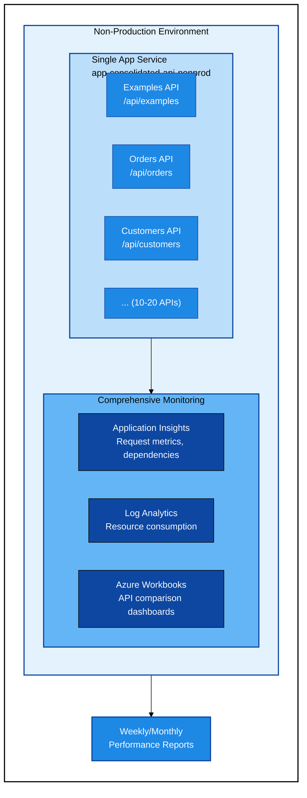
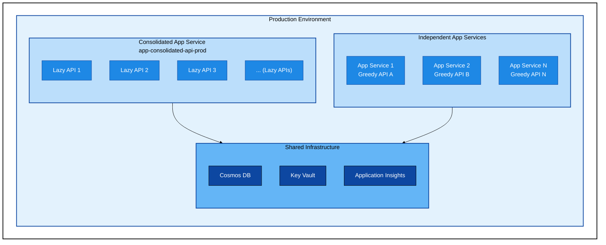
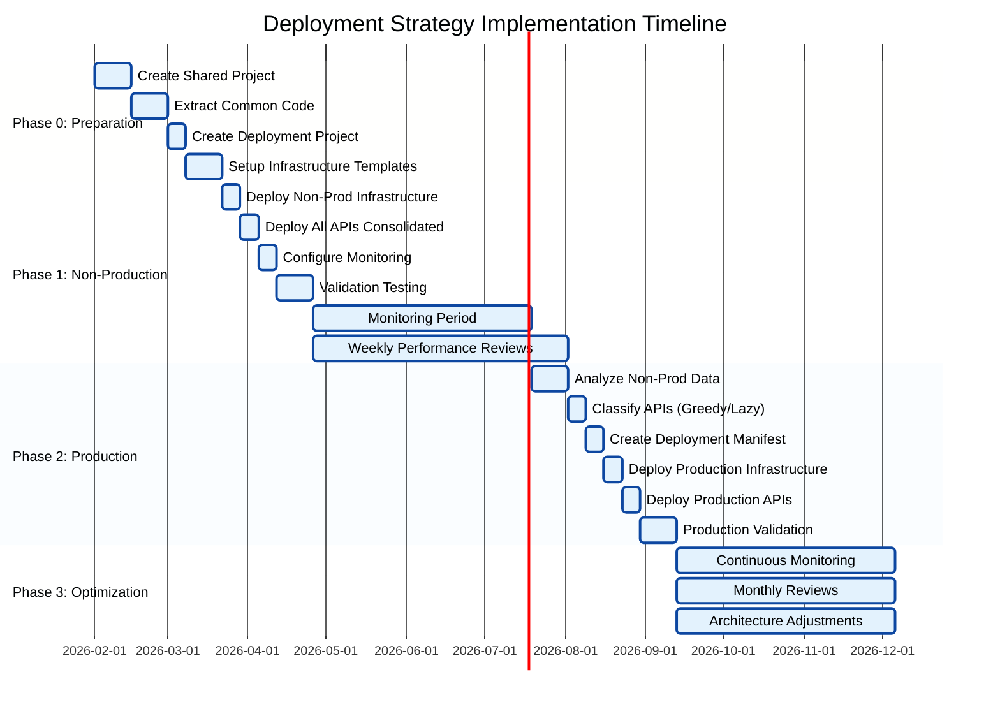

# Deployment Strategy: Progressive Architecture Evolution

## Document Information

**Date**: 2026-01-30  
**Status**: Active  
**Version**: 1.0  
**Owner**: Architecture Team  
**Review Cycle**: Quarterly  

## Executive Summary

This document defines the strategic approach for deploying multiple ASP.NET Core REST API projects from a single solution to Azure. The strategy employs a progressive, evidence-based approach that begins with consolidated deployment in non-production environments to gather performance metrics and identify resource consumption patterns, then evolves to a hybrid production architecture that optimally balances cost efficiency with operational requirements.

**Strategic Principles**:
1. **Evidence-Based Architecture**: Use non-production monitoring to inform production decisions
2. **Cost Optimization**: Maximize resource sharing while maintaining performance requirements
3. **Progressive Evolution**: Start consolidated, split only when data justifies it
4. **Operational Flexibility**: Maintain ability to deploy APIs independently when needed

**Expected Outcomes**:
- **Cost Reduction**: 70-85% savings compared to fully independent deployment
- **Simplified Operations**: Reduced management overhead through consolidation
- **Performance Optimization**: Data-driven resource allocation based on actual usage patterns
- **Risk Mitigation**: Non-production testing validates approach before production deployment

---

## Table of Contents

1. [Strategic Vision](#strategic-vision)
2. [Deployment Phases](#deployment-phases)
3. [Non-Production Environment Strategy](#non-production-environment-strategy)
4. [Production Environment Strategy](#production-environment-strategy)
5. [Monitoring and Decision Criteria](#monitoring-and-decision-criteria)
6. [Architecture Components](#architecture-components)
7. [Cost Analysis](#cost-analysis)
8. [Risk Management](#risk-management)
9. [Implementation Roadmap](#implementation-roadmap)
10. [Decision Framework](#decision-framework)
11. [Success Metrics](#success-metrics)

---

## Strategic Vision

### Overview

Our deployment strategy recognizes that the optimal architecture for production environments is best determined through empirical observation rather than upfront assumptions. By deploying a consolidated architecture in non-production environments with comprehensive monitoring, we can:

1. **Identify Resource Consumption Patterns**: Determine which APIs are "greedy" (high resource utilization) vs "lazy" (low resource utilization)
2. **Measure Performance Impact**: Quantify how APIs affect each other when sharing compute resources
3. **Validate Cost Models**: Confirm actual costs against projections
4. **De-Risk Production**: Test consolidation approach before committing to production architecture

### Architectural Philosophy

```mermaid
%%{init: {'theme':'base', 'themeVariables': { 'primaryColor':'#fff','primaryBorderColor':'#000','lineColor':'#000'}}}%%
flowchart TB
    subgraph Wrapper[" "]
        Start[Initial State: Multiple API Projects]
        
        Start --> Phase1[Phase 1: Non-Production<br/>Consolidated Deployment]
        
        Phase1 --> Monitor[Continuous Monitoring<br/>Performance & Resource Metrics]
        
        Monitor --> Analysis{Data Analysis:<br/>API Behavior Patterns}
        
        Analysis --> Greedy[Identify Greedy APIs<br/>High CPU/Memory/Request Load]
        Analysis --> Lazy[Identify Lazy APIs<br/>Low Resource Consumption]
        
        Greedy --> Phase2Prod[Phase 2: Production<br/>Hybrid Architecture]
        Lazy --> Phase2Prod
        
        Phase2Prod --> Consolidated[Consolidated App Service<br/>Lazy APIs Together]
        Phase2Prod --> Independent[Independent App Services<br/>Greedy APIs Isolated]
        
        Consolidated --> Optimize[Continuous<br/>Optimization]
        Independent --> Optimize
        
        Optimize --> Review{Quarterly<br/>Review}
        
        Review -->|Patterns Change| Adjust[Adjust Architecture]
        Review -->|Patterns Stable| Maintain[Maintain Architecture]
        
        Adjust --> Monitor
        Maintain --> Monitor
    end
    
    style Wrapper fill:#fff,stroke:#000,stroke-width:2px
    style Phase1 fill:#E3F2FD,stroke:#0D47A1,stroke-width:2px
    style Phase2Prod fill:#BBDEFB,stroke:#0D47A1,stroke-width:2px
    style Monitor fill:#64B5F6,stroke:#0D47A1,stroke-width:2px,color:#000
    style Analysis fill:#1E88E5,stroke:#0D47A1,stroke-width:2px,color:#fff
    style Optimize fill:#64B5F6,stroke:#0D47A1,stroke-width:2px,color:#000
    style Start fill:#BBDEFB,stroke:#0D47A1,stroke-width:2px
    style Greedy fill:#1E88E5,stroke:#0D47A1,stroke-width:2px,color:#fff
    style Lazy fill:#1E88E5,stroke:#0D47A1,stroke-width:2px,color:#fff
    style Consolidated fill:#0D47A1,stroke:#000,stroke-width:2px,color:#fff
    style Independent fill:#0D47A1,stroke:#000,stroke-width:2px,color:#fff
    style Review fill:#1E88E5,stroke:#0D47A1,stroke-width:2px,color:#fff
    style Adjust fill:#64B5F6,stroke:#0D47A1,stroke-width:2px,color:#000
    style Maintain fill:#64B5F6,stroke:#0D47A1,stroke-width:2px,color:#000
```



### Key Terminology

| Term | Definition |
|------|------------|
| **Greedy API** | API with high resource consumption (CPU > 60%, memory > 70%, or high request rates) that may impact co-located services |
| **Lazy API** | API with low resource consumption (CPU < 30%, memory < 40%, infrequent requests) suitable for resource sharing |
| **Consolidated Deployment** | Multiple APIs deployed to a single App Service, sharing compute resources |
| **Independent Deployment** | Single API deployed to dedicated App Service, isolated compute resources |
| **Hybrid Architecture** | Production deployment mixing consolidated and independent approaches based on workload patterns |

---

## Deployment Phases

### Phase 1: Non-Production Environment (Consolidated + Monitoring)

**Duration**: Initial 3-6 months  
**Objective**: Gather empirical data on API resource consumption and interaction patterns  
**Architecture**: Fully consolidated deployment  



**Key Activities**:
1. Deploy all APIs to single consolidated App Service
2. Implement comprehensive monitoring and alerting
3. Collect performance metrics for minimum 3 months
4. Generate weekly performance reports identifying resource patterns
5. Document API behavior: response times, request volumes, resource utilization
6. Test scaling behavior under various load conditions

**Success Criteria**:
- All APIs functional and meeting SLA requirements
- Complete performance baseline established
- Clear classification of greedy vs lazy APIs
- Cost model validated against actual consumption

### Phase 2: Production Environment (Hybrid Architecture)

**Start Date**: Following 3-6 months of non-production monitoring  
**Objective**: Deploy optimized architecture based on empirical data  
**Architecture**: Hybrid (consolidated + independent based on workload patterns)  



**Deployment Rules**:
1. **Default to Consolidated**: New APIs start in consolidated deployment
2. **Evidence-Based Isolation**: Move to independent deployment only when data shows:
   - Consistent high resource utilization (CPU > 60% or Memory > 70%)
   - Performance impact on co-located APIs
   - Distinct scaling requirements incompatible with consolidated group
3. **Continuous Monitoring**: Regular review of all APIs for reclassification

---

## Non-Production Environment Strategy

### Architecture: Consolidated Deployment

**Core Configuration**:
- **Deployment Model**: [Consolidated Deployment Architecture](consolidated-deployment-architecture.md)
- **Network Model**: [Private Endpoint Architecture](app-service-private-endpoint-architecture.md)
- **Project Structure**: DataLayer.API.Example.Deployment hosting all API projects

### Infrastructure Components

| Component | Configuration | Purpose |
|-----------|---------------|---------|
| **App Service Plan** | P1V3 Premium (2 cores, 8 GB RAM) | Host all APIs in single plan |
| **App Service** | app-consolidated-api-nonprod | Single host for all API projects |
| **Private Endpoint** | Single PE in Private Endpoint subnet | Inbound connectivity from VPN |
| **VNet Integration** | Shared integration subnet | Outbound connectivity to backends |
| **Cosmos DB** | Serverless (shared) | Backend database for all APIs |
| **Key Vault** | Standard (shared) | Secrets and certificate management |
| **Application Insights** | Workspace-based | **Detailed telemetry per API** |
| **Log Analytics** | Standard | Centralized logging and queries |

### Monitoring Configuration

**Critical Requirement**: Non-production monitoring must provide API-level granularity to support production architecture decisions.

#### Application Insights Configuration

```json
{
  "ApplicationInsights": {
    "ConnectionString": "[Key Vault Reference]",
    "EnableAdaptiveSampling": false,
    "SamplingPercentage": 100,
    "CloudRoleName": "consolidated-api-nonprod",
    "EnableDependencyTracking": true,
    "EnablePerformanceCounterCollection": true
  }
}
```

**Key Settings**:
- **Sampling Disabled**: Capture 100% of telemetry for accurate analysis
- **Cloud Role Name**: Single role for the host
- **Cloud Role Instance**: Use operation name to distinguish APIs
- **Custom Dimensions**: Add API project name to all telemetry

#### Telemetry Enrichment

**Middleware Implementation**:
```csharp
// Enrich telemetry with API project identifier
app.Use(async (context, next) =>
{
    var activity = Activity.Current;
    if (activity != null)
    {
        // Extract API name from route
        var apiName = context.Request.Path.Value?.Split('/')[2] ?? "unknown";
        activity.SetTag("api.name", apiName);
        activity.SetTag("api.project", GetProjectNameFromApi(apiName));
    }
    await next();
});
```

#### Monitoring Dashboards

**Azure Workbook**: API Performance Comparison

Key Visualizations:
1. **API Request Volume**: Requests/minute per API over time
2. **Resource Utilization**: CPU and memory consumption attributed to each API
3. **Response Time Distribution**: P50, P95, P99 percentiles per API
4. **Error Rates**: Failures per API
5. **Dependency Performance**: Cosmos DB, external API call patterns
6. **Concurrent Request Handling**: Peak concurrent requests per API

**Sample KQL Queries**:

```kusto
// API Resource Consumption Analysis
requests
| where timestamp > ago(7d)
| extend ApiName = tostring(customDimensions["api.name"])
| summarize 
    RequestCount = count(),
    AvgDuration = avg(duration),
    P95Duration = percentile(duration, 95),
    FailureRate = countif(success == false) * 100.0 / count()
  by ApiName, bin(timestamp, 1h)
| order by RequestCount desc

// Identify Greedy APIs (High Resource Consumers)
performanceCounters
| where timestamp > ago(7d)
| where name == "% Processor Time" or name == "Available Bytes"
| extend ApiName = tostring(customDimensions["api.name"])
| summarize 
    AvgCPU = avgif(value, name == "% Processor Time"),
    AvgMemoryMB = avgif(value / 1024 / 1024, name == "Available Bytes")
  by ApiName
| where AvgCPU > 60 or AvgMemoryMB < 2048
| order by AvgCPU desc
```

### Weekly Performance Reviews

**Schedule**: Every Monday morning  
**Attendees**: Architecture team, development leads  
**Duration**: 30 minutes  

**Agenda**:
1. Review API performance metrics from previous week
2. Identify any APIs showing greedy behavior patterns
3. Assess impact of any newly deployed APIs
4. Update API classification (greedy vs lazy)
5. Document findings in [Performance Review Log](performance-reviews/)

**Outputs**:
- Updated API classification spreadsheet
- Performance anomaly reports
- Recommendations for production architecture adjustments

---

## Production Environment Strategy

### Architecture: Hybrid Deployment

**Core Configuration**:
- **Base Model**: [Consolidated Deployment Architecture](consolidated-deployment-architecture.md) for lazy APIs
- **Isolation Model**: [Independent App Services (ADR 0001)](adr/0001-deploy-each-project-as-independent-app-service.md) for greedy APIs
- **Network Model**: [Private Endpoint Architecture](app-service-private-endpoint-architecture.md)

### Deployment Decision Matrix

| API Classification | Deployment Target | Rationale |
|-------------------|-------------------|-----------|
| **Lazy API** (CPU < 30%, Memory < 40%, Low request rate) | Consolidated App Service | Cost efficiency through resource sharing |
| **Moderate API** (CPU 30-60%, Memory 40-70%, Moderate requests) | Consolidated App Service (monitor closely) | Start consolidated, prepare to split if needed |
| **Greedy API** (CPU > 60%, Memory > 70%, High request rate) | Independent App Service | Prevent impact on other APIs |
| **Unpredictable API** (Highly variable load) | Independent App Service | Isolate scaling behavior |
| **Critical API** (Low tolerance for performance degradation) | Independent App Service | Ensure dedicated resources |

### Infrastructure Components

#### Consolidated App Service (Lazy APIs)

| Component | Configuration |
|-----------|---------------|
| **App Service Plan** | P1V3 Premium (2 cores, 8 GB RAM) |
| **App Service** | app-consolidated-api-prod |
| **APIs Hosted** | 5-15 lazy APIs (determined by non-production data) |
| **Scaling** | Auto-scale: 2-5 instances based on CPU/Memory |
| **Private Endpoint** | Single PE for consolidated host |
| **Monitoring** | Application Insights with API-level tracking |

#### Independent App Services (Greedy APIs)

| Component | Configuration |
|-----------|---------------|
| **App Service Plans** | P1V3 Premium per greedy API (or P2V3 if needed) |
| **App Services** | app-{api-name}-api-prod (one per greedy API) |
| **APIs Hosted** | 1 API per App Service |
| **Scaling** | Custom auto-scale rules per API requirements |
| **Private Endpoints** | One PE per independent App Service |
| **Monitoring** | Dedicated Application Insights or shared with custom dimensions |

### Network Architecture

**Consistent Across All Deployments**:
- **VNet**: 172.18.121.0/24 (existing)
- **Private Endpoint Subnet**: 172.18.121.160/27 (27 IPs available)
- **VNet Integration Subnet**: 172.18.121.192/26 (59 IPs available)
- **Private DNS Zones**: privatelink.azurewebsites.net (existing)
- **Connectivity**: Site-to-Site VPN Gateway (existing)

**Scaling Considerations**:
- Each Private Endpoint consumes exactly 1 IP
- Each App Service instance consumes 1-3 IPs from VNet Integration subnet
- Current allocation supports 20+ total deployments (consolidated + independent)

### Example Production Architecture

**Scenario**: 10 APIs analyzed in non-production, 2 identified as greedy

```
Production Environment:

Consolidated App Service (app-consolidated-api-prod):
├── Examples API (Lazy: CPU 15%, Memory 25%, 100 req/min)
├── Products API (Lazy: CPU 20%, Memory 30%, 150 req/min)
├── Categories API (Lazy: CPU 10%, Memory 20%, 50 req/min)
├── Suppliers API (Lazy: CPU 18%, Memory 28%, 80 req/min)
├── Reports API (Lazy: CPU 25%, Memory 35%, 200 req/min)
├── Analytics API (Lazy: CPU 22%, Memory 32%, 120 req/min)
├── Notifications API (Lazy: CPU 12%, Memory 22%, 60 req/min)
└── Settings API (Lazy: CPU 8%, Memory 18%, 30 req/min)

Independent App Service #1 (app-orders-api-prod):
└── Orders API (Greedy: CPU 75%, Memory 80%, 5,000 req/min)

Independent App Service #2 (app-customers-api-prod):
└── Customers API (Greedy: CPU 68%, Memory 72%, 3,500 req/min)

Shared Infrastructure:
├── Cosmos DB (cosmos-apis-prod)
├── Key Vault (kv-apis-prod)
└── Application Insights (appi-apis-prod)
```

**Hostname Resolution** (Private DNS):
- `app-consolidated-api-prod.azurewebsites.net` → 172.18.121.160
- `app-orders-api-prod.azurewebsites.net` → 172.18.121.161
- `app-customers-api-prod.azurewebsites.net` → 172.18.121.162

**Client DLL Routing**:
```csharp
// Client DLL knows the deployment topology
public class ApiClient
{
    private readonly Dictionary<string, string> _apiHosts = new()
    {
        // Lazy APIs - Consolidated
        ["examples"] = "app-consolidated-api-prod.azurewebsites.net",
        ["products"] = "app-consolidated-api-prod.azurewebsites.net",
        ["categories"] = "app-consolidated-api-prod.azurewebsites.net",
        // ... other lazy APIs
        
        // Greedy APIs - Independent
        ["orders"] = "app-orders-api-prod.azurewebsites.net",
        ["customers"] = "app-customers-api-prod.azurewebsites.net"
    };
}
```

---

## Monitoring and Decision Criteria

### Key Performance Indicators (KPIs)

#### Resource Utilization Metrics

| Metric | Measurement | Greedy Threshold | Lazy Threshold |
|--------|-------------|------------------|----------------|
| **CPU Utilization** | Average over 24 hours | > 60% | < 30% |
| **Memory Utilization** | Average over 24 hours | > 70% | < 40% |
| **Request Rate** | Requests per minute | > 1,000 req/min | < 200 req/min |
| **Response Time Impact** | P95 degradation when co-located | > 20% increase | < 5% increase |
| **Concurrent Requests** | Peak concurrent requests | > 100 concurrent | < 20 concurrent |

#### Performance Impact Metrics

| Metric | Measurement | Action Threshold |
|--------|-------------|------------------|
| **P95 Response Time** | 95th percentile response time | > 500ms or >20% baseline degradation |
| **Error Rate** | Failed requests / total requests | > 1% |
| **Dependency Call Duration** | Average time to Cosmos DB, external APIs | > 200ms |
| **Request Queue Length** | Queued requests waiting for processing | > 50 |

### Decision Criteria for API Isolation

An API should be moved from consolidated to independent deployment when:

1. **Resource Consumption** (Any of):
   - CPU utilization > 60% sustained for 7+ days
   - Memory utilization > 70% sustained for 7+ days
   - Request rate > 1,000 req/min sustained

2. **Performance Impact** (Any of):
   - Co-located APIs show > 20% P95 response time degradation
   - Error rate increases when this API is under load
   - Auto-scaling triggers consistently due to this API alone

3. **Scaling Requirements**:
   - API requires different scaling profile than consolidated group
   - Scaling consolidated group for this API wastes resources for other APIs

4. **Business Criticality**:
   - API is identified as mission-critical with zero tolerance for noisy neighbor effects
   - SLA requirements stricter than consolidated deployment can guarantee

### Monthly Architecture Review

**Schedule**: First Monday of each month  
**Attendees**: Architecture team, development leads, operations team  
**Duration**: 1 hour  

**Review Process**:
1. Analyze previous month's performance data
2. Review API classifications (greedy vs lazy)
3. Evaluate cost vs performance trade-offs
4. Identify any APIs that should be reclassified
5. Plan any architectural adjustments
6. Update deployment strategy document if needed

**Outputs**:
- Monthly architecture review report
- Updated API classification
- Infrastructure change requests (if needed)
- Updated cost projections

---

## Architecture Components

### Development Environment

**Unchanged**: Developers continue to work with individual API projects locally.

**Supported Workflows**:
- Run individual API projects (e.g., DataLayer.API.Example) for isolated development
- Run consolidated deployment project (DataLayer.API.Example.Deployment) for integration testing
- Run selective APIs via launchSettings.json profiles

**Reference**: [Consolidated Deployment Architecture - Development Workflow](consolidated-deployment-architecture.md#development-workflow)

### CI/CD Pipeline

**Single Pipeline Strategy**: One deployment pipeline supports both consolidated and independent deployments.

**Pipeline Location**: `DataLayer.API.Example.Deployment/.github/workflows/`

**Deployment Workflows**:
1. **deploy-non-production.yml**: Deploys all APIs to consolidated non-production App Service
2. **deploy-production.yml**: Deploys APIs based on deployment manifest
   - Consolidated APIs → app-consolidated-api-prod
   - Greedy APIs → individual App Services
3. **pr-validation.yml**: Validates all changes across entire solution

**Deployment Manifest** (`deployment-manifest.json`):
```json
{
  "environment": "production",
  "consolidated": {
    "appService": "app-consolidated-api-prod",
    "apis": [
      "DataLayer.API.Example",
      "DataLayer.API.Example.Products",
      "DataLayer.API.Example.Categories",
      "DataLayer.API.Example.Suppliers",
      "DataLayer.API.Example.Reports",
      "DataLayer.API.Example.Analytics",
      "DataLayer.API.Example.Notifications",
      "DataLayer.API.Example.Settings"
    ]
  },
  "independent": [
    {
      "appService": "app-orders-api-prod",
      "api": "DataLayer.API.Example.Orders"
    },
    {
      "appService": "app-customers-api-prod",
      "api": "DataLayer.API.Example.Customers"
    }
  ]
}
```

### Infrastructure as Code

**Bicep Templates**: `DataLayer.API.Example.Deployment/infrastructure/`

**Key Templates**:
- `main.bicep`: Orchestrates all infrastructure
- `modules/consolidated-app-service.bicep`: Consolidated deployment resources
- `modules/independent-app-service.bicep`: Independent API resources (reusable)
- `modules/shared-infrastructure.bicep`: Cosmos DB, Key Vault, Application Insights

**Parameters**:
- `parameters/non-production.bicepparam`: All APIs consolidated
- `parameters/production.bicepparam`: Hybrid deployment per manifest

---

## Cost Analysis

### Non-Production Environment

**Configuration**: Fully consolidated deployment

| Resource | Tier | Quantity | Monthly Cost (USD) |
|----------|------|----------|-------------------|
| App Service Plan | P1V3 Premium | 1 | $150 |
| Cosmos DB | Serverless | 1 | $25-50 |
| Key Vault | Standard | 1 | $5 |
| Application Insights | Pay-as-you-go (100% sampling) | 1 | $30-80 |
| Log Analytics | Standard | 1 | $10-20 |
| Private Endpoint | Standard | 1 | $7 |
| VNet | Included | 1 | $0 |
| **Total** | | | **$227-312/month** |

**Per-API Cost**: $23-31/month (for 10 APIs)

### Production Environment

**Configuration**: Hybrid deployment (8 lazy, 2 greedy)

#### Consolidated Group (8 Lazy APIs)

| Resource | Tier | Quantity | Monthly Cost (USD) |
|----------|------|----------|-------------------|
| App Service Plan | P1V3 Premium (2-5 instances) | 1 | $150-375 |
| Private Endpoint | Standard | 1 | $7 |

**Subtotal**: $157-382/month  
**Per-API Cost**: $20-48/month

#### Independent Deployments (2 Greedy APIs)

| Resource | Tier | Quantity | Monthly Cost (USD) |
|----------|------|----------|-------------------|
| App Service Plans | P1V3 Premium each (2-5 instances) | 2 | $300-750 |
| Private Endpoints | Standard | 2 | $14 |

**Subtotal**: $314-764/month  
**Per-API Cost**: $157-382/month

#### Shared Infrastructure

| Resource | Tier | Quantity | Monthly Cost (USD) |
|----------|------|----------|-------------------|
| Cosmos DB | Serverless | 1 | $50-150 |
| Key Vault | Standard | 1 | $5 |
| Application Insights | Pay-as-you-go | 1 | $30-100 |
| Log Analytics | Standard | 1 | $15-30 |

**Subtotal**: $100-285/month

#### Production Total

**Total Monthly Cost**: $571-1,431/month  
**Average Cost Per API**: $57-143/month

### Cost Comparison

| Deployment Model | Monthly Cost (10 APIs) | Cost Per API | Savings vs Fully Independent |
|------------------|------------------------|--------------|------------------------------|
| **Fully Independent** | $1,500-2,000 | $150-200 | Baseline |
| **Fully Consolidated** | $227-467 | $23-47 | 85-88% |
| **Hybrid (8+2)** | $571-1,431 | $57-143 | 28-62% |
| **Non-Production** | $227-312 | $23-31 | 84-85% |

**Key Insights**:
- **Non-production**: Maximum cost efficiency (85% savings)
- **Production Hybrid**: Balance of efficiency and performance (28-62% savings depending on greedy API requirements)
- **Flexibility**: Can adjust architecture based on actual patterns without upfront over-investment

---

## Risk Management

### Identified Risks

#### Risk 1: Noisy Neighbor Effect in Consolidated Deployment

**Description**: One API consuming excessive resources impacts performance of co-located APIs

**Mitigation**:
- **Non-production Testing**: Validate consolidation approach for 3-6 months before production
- **Comprehensive Monitoring**: Real-time alerts for resource consumption anomalies
- **Quick Isolation**: Pre-built infrastructure templates for rapid API extraction
- **Performance SLAs**: Define acceptable performance thresholds per API

**Contingency**: Move problematic API to independent deployment within 24-48 hours

#### Risk 2: Insufficient Monitoring Data

**Description**: Non-production usage doesn't reflect production patterns

**Mitigation**:
- **Extended Observation Period**: Minimum 3 months of non-production monitoring
- **Load Testing**: Simulate production-like traffic patterns in non-production
- **Synthetic Monitoring**: Generate baseline traffic if real usage is low
- **Conservative Classification**: When in doubt, classify as "moderate" (monitored closely)

**Contingency**: Deploy production with ability to quickly re-classify and adjust

#### Risk 3: Deployment Complexity

**Description**: Hybrid deployment model increases operational complexity

**Mitigation**:
- **Deployment Manifest**: Single source of truth for API placement
- **Automated Pipeline**: CI/CD handles complexity, minimal manual intervention
- **Infrastructure as Code**: All environments defined in Bicep, version controlled
- **Documentation**: Clear decision criteria and procedures

**Contingency**: Fall back to fully consolidated if complexity becomes unmanageable

#### Risk 4: Cost Overruns

**Description**: More APIs than expected classified as greedy, increasing costs

**Mitigation**:
- **Non-production Validation**: Identify greedy patterns early
- **Cost Monitoring**: Azure Cost Management alerts for budget thresholds
- **Regular Review**: Monthly architecture reviews assess cost vs performance
- **Optimization Options**: Consider P2V3 plans for better multi-tenancy before fully splitting

**Contingency**: Re-evaluate consolidation groupings, optimize App Service Plan sizing

### Risk Matrix

| Risk | Likelihood | Impact | Mitigation Effectiveness | Residual Risk |
|------|------------|--------|-------------------------|---------------|
| Noisy Neighbor | Medium | High | High (monitoring + quick isolation) | Low |
| Insufficient Data | Low | Medium | High (extended observation) | Low |
| Deployment Complexity | Low | Medium | High (automation) | Low |
| Cost Overruns | Low | Medium | Medium (ongoing monitoring) | Medium |

---

## Implementation Roadmap

### Timeline Overview



### Phase 0: Preparation (6-7 weeks)

#### Week 1-2: Create Shared Infrastructure
- [ ] Create `DataLayer.API.Example.Shared` class library project
- [ ] Move common code: CosmosDbExtensions, RepositoryBase, Configuration
- [ ] Update existing projects to reference Shared project
- [ ] Run all tests to ensure no regressions

#### Week 3-4: Extract Service Registration
- [ ] Create service registration extension methods per API project
- [ ] Refactor Program.cs in each API to use extension methods
- [ ] Test each API independently
- [ ] Document service registration patterns

#### Week 5: Create Deployment Project
- [ ] Create `DataLayer.API.Example.Deployment` project
- [ ] Implement consolidated Program.cs loading all APIs
- [ ] Add launchSettings.json with multiple profiles
- [ ] Test consolidated deployment locally

#### Week 6-7: Infrastructure as Code
- [ ] Create Bicep templates for non-production
- [ ] Create Bicep templates for production (consolidated + independent modules)
- [ ] Create parameter files for each environment
- [ ] Setup CI/CD workflows

**Milestone**: Ready for non-production deployment

### Phase 1: Non-Production Deployment (14-16 weeks)

#### Week 8: Deploy Infrastructure
- [ ] Deploy Azure infrastructure for non-production
- [ ] Configure Private Endpoints and VNet Integration
- [ ] Setup Private DNS zones
- [ ] Validate network connectivity

#### Week 9: Deploy Applications
- [ ] Deploy consolidated App Service
- [ ] Deploy all API projects
- [ ] Configure Application Insights
- [ ] Setup Log Analytics workspace

#### Week 10: Configure Monitoring
- [ ] Create Azure Workbooks for API comparison
- [ ] Setup KQL queries for performance analysis
- [ ] Configure alerts for anomalous behavior
- [ ] Document monitoring procedures

#### Week 11-12: Validation Testing
- [ ] Functional testing of all APIs
- [ ] Load testing to validate scaling
- [ ] Security testing (Private Endpoint access)
- [ ] Document any issues and resolutions

#### Week 13-24: Monitoring Period (3 months minimum)
- [ ] Weekly performance data collection
- [ ] Weekly performance review meetings
- [ ] Document API behavior patterns
- [ ] Update API classifications as patterns emerge
- [ ] Generate monthly summary reports

**Milestone**: Complete understanding of API resource patterns

### Phase 2: Production Deployment (6-7 weeks)

#### Week 25-26: Data Analysis
- [ ] Comprehensive analysis of non-production metrics
- [ ] Classification of all APIs (greedy vs lazy)
- [ ] Cost modeling for hybrid architecture
- [ ] Risk assessment for production deployment

#### Week 27: Create Deployment Plan
- [ ] Create production deployment manifest
- [ ] Document API placement decisions
- [ ] Plan rollout schedule
- [ ] Communication to stakeholders

#### Week 28: Deploy Production Infrastructure
- [ ] Deploy production Azure infrastructure
- [ ] Configure network components
- [ ] Setup monitoring and alerting
- [ ] Validate infrastructure readiness

#### Week 29: Deploy Production Applications
- [ ] Deploy consolidated App Service with lazy APIs
- [ ] Deploy independent App Services for greedy APIs
- [ ] Configure Application Insights per deployment
- [ ] Update client DLL with production hostnames

#### Week 30-31: Production Validation
- [ ] Smoke testing all endpoints
- [ ] Load testing under production-like conditions
- [ ] Security validation
- [ ] Performance baseline establishment
- [ ] 24/7 monitoring for first week

**Milestone**: Production deployment complete and validated

### Phase 3: Continuous Optimization (Ongoing)

#### Ongoing Activities
- [ ] Daily performance monitoring
- [ ] Weekly metrics review
- [ ] Monthly architecture review meetings
- [ ] Quarterly cost optimization reviews
- [ ] Bi-annual API reclassification
- [ ] Continuous documentation updates

**Success Metrics**: See [Success Metrics](#success-metrics) section

---

## Decision Framework

### When to Add a New API

**Question**: Where should a new API be deployed?

**Decision Tree**:

```mermaid
%%{init: {'theme':'base', 'themeVariables': { 'primaryColor':'#fff','primaryBorderColor':'#000','lineColor':'#000'}}}%%
flowchart TD
    subgraph Wrapper[" "]
        Start[New API Project Created]
        
        Start --> Dev[Deploy to Development:<br/>Independent Project]
        
        Dev --> NonProd{Is Non-Production<br/>Environment Active?}
        
        NonProd -->|Yes| AddToConsolidated[Add to Non-Production<br/>Consolidated Deployment]
        NonProd -->|No| SetupNonProd[Setup Non-Production First]
        
        AddToConsolidated --> Monitor[Monitor for 4-8 weeks]
        
        Monitor --> Classify{API Classification}
        
        Classify -->|Lazy| AddToProdConsolidated[Add to Production<br/>Consolidated App Service]
        Classify -->|Greedy| AddToProdIndependent[Deploy to Production<br/>Independent App Service]
        Classify -->|Moderate| MonitorClosely[Add to Consolidated<br/>Monitor Closely]
        
        MonitorClosely --> Review[Review After<br/>30 Days]
        
        Review -->|Still Moderate| KeepConsolidated[Keep in Consolidated]
        Review -->|Becoming Greedy| MoveToProdIndependent[Move to Independent]
    end
    
    style Wrapper fill:#fff,stroke:#000,stroke-width:2px
    style Start fill:#E3F2FD,stroke:#0D47A1,stroke-width:2px
    style Dev fill:#BBDEFB,stroke:#0D47A1,stroke-width:2px
    style NonProd fill:#64B5F6,stroke:#0D47A1,stroke-width:2px,color:#000
    style AddToConsolidated fill:#1E88E5,stroke:#0D47A1,stroke-width:2px,color:#fff
    style SetupNonProd fill:#1E88E5,stroke:#0D47A1,stroke-width:2px,color:#fff
    style Monitor fill:#64B5F6,stroke:#0D47A1,stroke-width:2px,color:#000
    style Classify fill:#1E88E5,stroke:#0D47A1,stroke-width:2px,color:#fff
    style AddToProdConsolidated fill:#0D47A1,stroke:#000,stroke-width:2px,color:#fff
    style AddToProdIndependent fill:#0D47A1,stroke:#000,stroke-width:2px,color:#fff
    style MonitorClosely fill:#64B5F6,stroke:#0D47A1,stroke-width:2px,color:#000
    style Review fill:#1E88E5,stroke:#0D47A1,stroke-width:2px,color:#fff
    style KeepConsolidated fill:#0D47A1,stroke:#000,stroke-width:2px,color:#fff
    style MoveToProdIndependent fill:#0D47A1,stroke:#000,stroke-width:2px,color:#fff
```


**Default Rule**: New APIs start in consolidated deployment unless business-critical or known high-volume requirements dictate otherwise.

### When to Move an API from Consolidated to Independent

**Decision Criteria** (trigger isolation when **any** of these are met):

1. **Performance Degradation**:
   - API consistently exceeds resource thresholds (CPU > 60%, Memory > 70%)
   - Co-located APIs show > 20% P95 response time increase

2. **Scaling Mismatch**:
   - API triggers auto-scaling but other APIs don't need additional resources
   - Scaling for this API increases costs disproportionately

3. **Business Criticality**:
   - API becomes mission-critical with strict SLA requirements
   - Cannot tolerate any potential noisy neighbor effects

4. **Operational Complexity**:
   - API deployment frequency is significantly different from consolidated group
   - API has unique configuration requirements incompatible with consolidation

**Process**:
1. Document decision rationale
2. Create infrastructure for independent deployment
3. Update deployment manifest
4. Deploy to independent App Service
5. Update client DLL routing
6. Remove from consolidated deployment
7. Monitor for 30 days to validate improvement

### When to Move an API from Independent to Consolidated

**Decision Criteria** (trigger consolidation when **all** of these are met):

1. **Low Resource Utilization**:
   - Sustained CPU < 30%, Memory < 40% for 60+ days
   - Request rate < 200 req/min

2. **Cost Efficiency Opportunity**:
   - Independent deployment costs > 3x consolidated per-API cost
   - No performance benefit from isolation

3. **Stable Performance**:
   - Predictable load patterns
   - No sudden traffic spikes

**Process**:
1. Analyze 90 days of performance data
2. Document consolidation proposal
3. Approval from architecture review board
4. Update deployment manifest
5. Add to consolidated deployment
6. Update client DLL routing
7. Decommission independent App Service after 30-day parallel run
8. Monitor consolidated deployment for any impacts

---

## Success Metrics

### Non-Production Phase Success Criteria

**Technical Metrics**:
- [ ] All APIs operational with < 1% error rate
- [ ] 100% telemetry collection (no sampling)
- [ ] API classification complete with confidence > 90%
- [ ] Performance baselines established for all APIs
- [ ] 3+ months of continuous monitoring data

**Operational Metrics**:
- [ ] Weekly performance reviews conducted (12+ weeks)
- [ ] Performance review documentation complete
- [ ] No critical incidents in non-production
- [ ] Development team productivity maintained (no regression in local dev experience)

**Financial Metrics**:
- [ ] Actual non-production costs within 10% of projections
- [ ] Cost per API < $35/month
- [ ] ROI calculation for production deployment shows > 50% savings

### Production Phase Success Criteria

**Technical Metrics**:
- [ ] All APIs meeting SLA requirements (P95 < 500ms, availability > 99.9%)
- [ ] Error rates < 1% across all deployments
- [ ] Zero security incidents
- [ ] Successful auto-scaling under load

**Operational Metrics**:
- [ ] Deployment success rate > 95%
- [ ] Mean time to deployment < 20 minutes
- [ ] Zero production incidents related to architecture decisions
- [ ] Monthly architecture reviews conducted

**Financial Metrics**:
- [ ] Production costs within 10% of projections
- [ ] Achieved > 50% cost savings vs fully independent deployment
- [ ] Cost per API: $57-143/month (hybrid model)

### Long-Term Success Indicators (12 months)

**Technical**:
- APIs correctly classified (< 5% reclassifications needed)
- Performance maintained or improved vs baseline
- Zero architecture-related outages

**Operational**:
- Development velocity maintained or improved
- Simplified deployment processes
- Reduced operational toil

**Financial**:
- Sustained cost savings > 50% vs alternative architectures
- Predictable monthly costs (variance < 15%)
- Positive ROI on monitoring investments

---

## Related Documentation

### Architecture Documents
- [Consolidated Deployment Architecture](consolidated-deployment-architecture.md) - Detailed technical architecture
- [App Service Private Endpoint Architecture](app-service-private-endpoint-architecture.md) - Network architecture
- [App Service Application Gateway Architecture](app-service-application-gateway-architecture.md) - Alternative (not selected)
- [Azure Resource Requirements](azure-resource-requirements.md) - Infrastructure specifications

### Architecture Decision Records (ADRs)
- [ADR 0001: Deploy Each Project as Independent Azure App Service](adr/0001-deploy-each-project-as-independent-app-service.md)
- [ADR 0002: Use Regular App Service with Application Gateway](adr/0002-use-regular-app-service-with-application-gateway.md)
- [ADR 0003: Use Private Endpoints Only (No Application Gateway)](adr/0003-use-private-endpoints-only-no-application-gateway.md)
- [ADR 0004: Progressive Deployment Strategy](adr/0004-progressive-deployment-strategy.md) - *To be created*
- [ADR 0005: Hybrid Production Architecture](adr/0005-hybrid-production-architecture.md) - *To be created*

### Operational Documents
- Performance Review Log - *To be created in `/docs/performance-reviews/`*
- API Classification Spreadsheet - *To be created*
- Monthly Architecture Review Reports - *To be created in `/docs/reviews/`*

---

## Document History

| Version | Date | Author | Changes |
|---------|------|--------|---------|
| 1.0 | 2026-01-30 | Architecture Team | Initial strategy document |

---

## Approval

| Role | Name | Signature | Date |
|------|------|-----------|------|
| **Chief Architect** | | | |
| **Engineering Lead** | | | |
| **Operations Lead** | | | |
| **Finance Approval** | | | |

---

**Next Review Date**: 2026-04-30 (Quarterly)  
**Document Owner**: Architecture Team  
**Contact**: architecture@company.com
