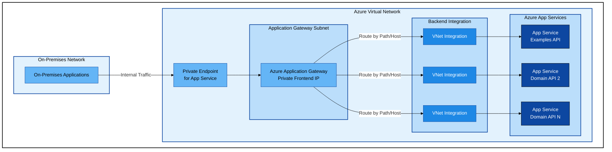
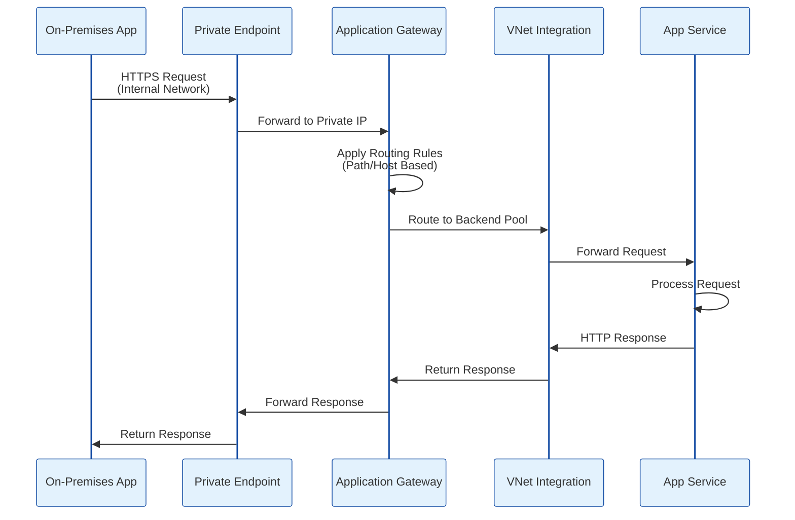
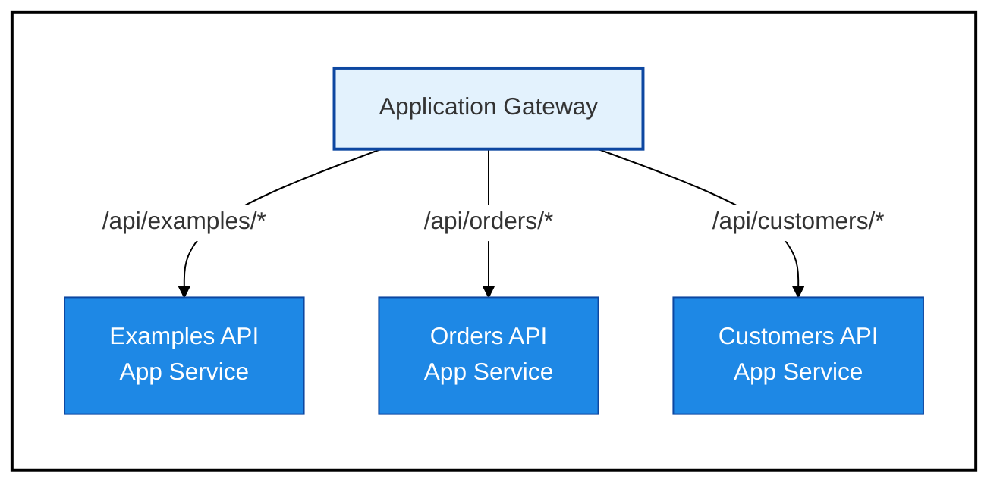
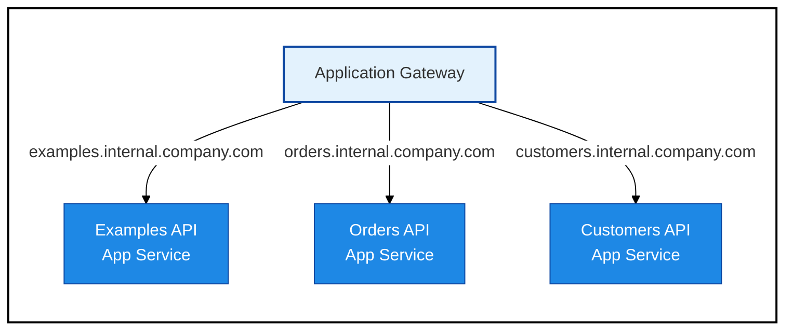
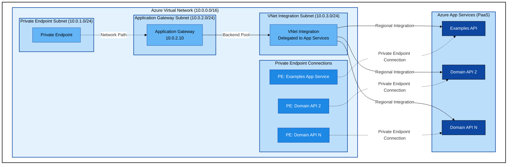

# Azure App Service Application Gateway Architecture

## Document Information

**Date**: 2026-01-30  
**Status**: **NOT SELECTED** - Reference Only  
**Note**: This architecture was considered but **rejected** in favor of Private Endpoints only. See [ADR 0003](adr/0003-use-private-endpoints-only-no-application-gateway.md) for rationale.  
**Related Documentation**:
- [Deployment Strategy](deployment-strategy.md) - **Selected approach** - Overall strategic architecture
- [ADR 0003: Use Private Endpoints Only (No Application Gateway)](adr/0003-use-private-endpoints-only-no-application-gateway.md) - **Decision to reject Application Gateway**
- [App Service Private Endpoint Architecture](app-service-private-endpoint-architecture.md) - **Selected network architecture**
- [ADR 0001: Deploy Each Project as Independent Azure App Service](adr/0001-deploy-each-project-as-independent-app-service.md) - Independent deployment approach

## Overview

> ⚠️ **IMPORTANT**: This document describes an architecture that was evaluated but **NOT selected** for implementation. It is retained for reference purposes only.
> 
> **Selected Approach**: Private Endpoints only (no Application Gateway)  
> **Reason for Rejection**: Application Gateway adds $250-400/month cost with minimal value for internal-only, trusted traffic. Client DLL handles routing, eliminating need for centralized gateway.  
> **See**: [ADR 0003: Use Private Endpoints Only](adr/0003-use-private-endpoints-only-no-application-gateway.md)

This document describes a **rejected** architecture for deploying multiple ASP.NET Core REST API projects from a single solution to Azure App Service, with internal-only access routed through Azure Application Gateway. While this architecture is technically sound, it was determined to be unnecessarily complex and costly for our specific requirements.

## Architecture Goals

- Deploy each API project as an independent Azure App Service
- Provide internal-only access to all deployed APIs
- Route traffic from on-premises applications through a single Private Endpoint
- Use Azure Application Gateway as the central routing mechanism
- Maintain network security and isolation for all components

## High-Level Architecture

## Architecture Components

### 1. On-Premises Applications

- Internal applications requiring access to Azure-hosted APIs
- Connect to Azure through established network connectivity (ExpressRoute, Site-to-Site VPN, etc.)
- Access APIs exclusively through the dedicated Private Endpoint

### 2. Azure Private Endpoint

- **Purpose**: Single entry point from on-premises network to Azure App Service infrastructure
- **Configuration**: Dedicated to Azure App Service deployments for internal APIs
- **Network Placement**: Deployed within the Azure Virtual Network
- **Access Control**: Configured to accept traffic only from authorized on-premises networks

### 3. Azure Application Gateway

- **Role**: Layer 7 load balancer and routing gateway
- **Frontend Configuration**: Private IP address (no public endpoint)
- **Backend Pools**: One pool per App Service or consolidated pools based on routing strategy
- **Routing Rules**: Path-based or host-based routing to direct traffic to appropriate App Services
- **Features**:
  - SSL/TLS termination
  - Web Application Firewall (WAF) capabilities
  - URL-based routing
  - Session affinity
  - Health probes for backend services

### 4. Virtual Network Integration

- **Purpose**: Enables App Services to communicate within the VNet
- **Implementation**: Each App Service integrates with a dedicated subnet or shared integration subnet
- **Security**: Ensures App Services can only be reached through internal network paths
- **Configuration**: Regional VNet Integration for optimal performance

### 5. Azure App Services

- **Deployment Model**: Each REST API project deployed as an independent App Service
- **Network Configuration**: Private endpoint-enabled for incoming traffic
- **Access Restrictions**: Configured to accept traffic only from Application Gateway subnet
- **Scaling**: Each App Service can scale independently based on domain-specific load
- **Current Deployments**:
  - Examples API (DataLayer.API.Example project)
  - Future domain-specific APIs as new projects are added to the solution

## Traffic Flow

### Traffic Flow Details

1. **Request Initiation**: On-premises application sends HTTPS request through internal network
2. **Private Endpoint Entry**: Traffic enters Azure through the dedicated Private Endpoint
3. **Application Gateway Routing**: 
   - Request arrives at Application Gateway's private frontend IP
   - Routing rules evaluate the request (URL path, hostname, headers)
   - Appropriate backend pool selected based on routing criteria
4. **VNet Integration**: Traffic routed through VNet integration to target App Service
5. **App Service Processing**: Target App Service receives and processes the request
6. **Response Path**: Response follows reverse path back to on-premises application

## Routing Strategies

### Path-Based Routing

Route traffic based on URL paths to different App Services:

**Example Configuration**:
- `https://internal-api.company.com/api/examples/*` → Examples App Service
- `https://internal-api.company.com/api/orders/*` → Orders App Service
- `https://internal-api.company.com/api/customers/*` → Customers App Service

### Host-Based Routing

Route traffic based on hostname to different App Services:

**Example Configuration**:
- `https://examples.internal.company.com/*` → Examples App Service
- `https://orders.internal.company.com/*` → Orders App Service
- `https://customers.internal.company.com/*` → Customers App Service

## Network Topology

## Security Considerations

### Network Security

- **Private Endpoints Only**: No public endpoints exposed for App Services
- **Network Segmentation**: Proper subnet isolation for each component layer
- **Access Restrictions**: App Services configured with IP restrictions allowing only Application Gateway subnet
- **Network Security Groups (NSGs)**: Applied to subnets to control traffic flow
- **Service Endpoints**: Enable where appropriate for Azure service access

### Application Security

- **SSL/TLS**: End-to-end encryption enforced
- **Web Application Firewall**: Enable WAF on Application Gateway for threat protection
- **Managed Identities**: Use for service-to-service authentication
- **Azure Key Vault**: Store and manage certificates, secrets, and connection strings
- **API Authentication**: Implement OAuth 2.0/OpenID Connect for API authorization

### Monitoring and Compliance

- **Application Insights**: Centralized logging and monitoring across all App Services
- **Azure Monitor**: Infrastructure monitoring and alerting
- **Diagnostic Logs**: Enable for Application Gateway and App Services
- **Audit Trails**: Track configuration changes and access patterns

## Cost Optimization

### Shared App Service Plans

- Deploy multiple App Services to shared App Service Plans where appropriate
- Balance cost savings with isolation requirements
- Consider separate plans for different environments (dev, test, prod)

### Application Gateway Sizing

- Right-size Application Gateway SKU based on expected throughput
- Use autoscaling to handle variable load patterns
- Consider Application Gateway v2 for better performance and features

### Private Endpoint Costs

- Each Private Endpoint incurs hourly charges plus data processing fees
- Consolidate Private Endpoints where possible without compromising security

## Scalability

### Independent Scaling

- Each App Service scales independently based on CPU, memory, or custom metrics
- Application Gateway autoscales based on traffic patterns
- No single point of bottleneck in the architecture

### Growth Accommodation

- Adding new domain APIs requires:
  1. Deploy new App Service
  2. Configure VNet Integration
  3. Add backend pool to Application Gateway
  4. Create routing rules
  5. Configure Private Endpoint access (if needed)

## Deployment Considerations

### Infrastructure as Code

- Use Bicep or Terraform to define and provision infrastructure
- Version control all infrastructure definitions
- Implement CI/CD for infrastructure changes

### Application Deployment

- Each App Service deploys independently via CI/CD pipelines
- Use deployment slots for zero-downtime deployments
- Implement health checks and smoke tests

### Configuration Management

- Store environment-specific configuration in Azure App Configuration or Key Vault
- Use managed identities to access configuration securely
- Implement configuration validation before deployment

## Future Enhancements

### Potential Improvements

- **Azure API Management**: Add API Management layer for advanced API governance, versioning, and developer portal
- **Azure Front Door**: Consider for global load balancing if multi-region deployment is needed
- **Container-Based Deployment**: Evaluate migration to Azure Container Apps or AKS for containerized workloads
- **Service Mesh**: Implement service mesh for advanced traffic management and observability

### Monitoring Enhancements

- Distributed tracing across all APIs
- Custom dashboards for business metrics
- Automated alerting and incident response
- Cost analysis and optimization recommendations

## References

### Azure Documentation

- [App Service networking features](https://learn.microsoft.com/azure/app-service/networking-features)
- [Integrate your app with an Azure virtual network](https://learn.microsoft.com/azure/app-service/overview-vnet-integration)
- [Using private endpoints for Azure App Service](https://learn.microsoft.com/azure/app-service/networking/private-endpoint)
- [What is Azure Application Gateway?](https://learn.microsoft.com/azure/application-gateway/overview)
- [Application Gateway configuration overview](https://learn.microsoft.com/azure/application-gateway/configuration-overview)

### Related Documentation

- [ADR 0001: Deploy Each Project as Independent Azure App Service](adr/0001-deploy-each-project-as-independent-app-service.md)
- [ADR 0006: Deploy Entire Solution as Single App Service (Rejected)](adr/0006-deploy-entire-solution-as-single-app-service.md)
- [ADR 0007: Use Azure App Service Deployment Slots (Rejected)](adr/0007-use-azure-app-service-deployment-slots.md)
