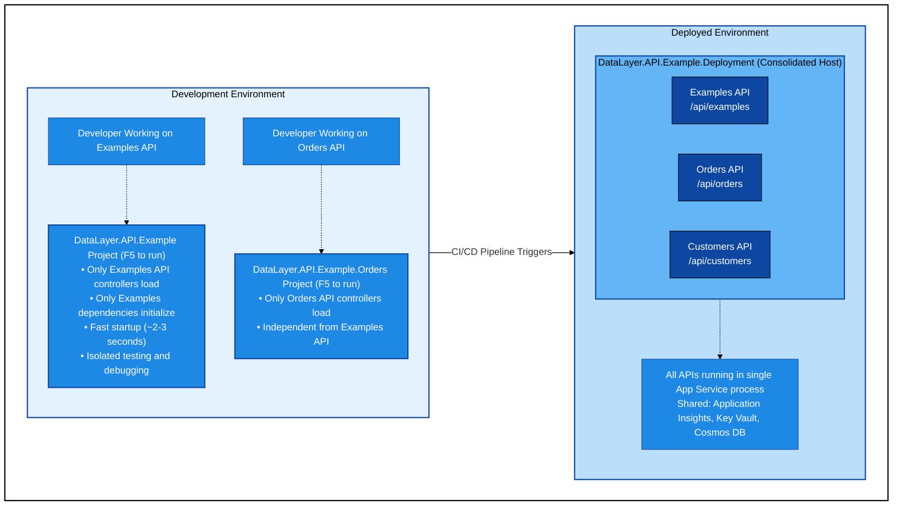
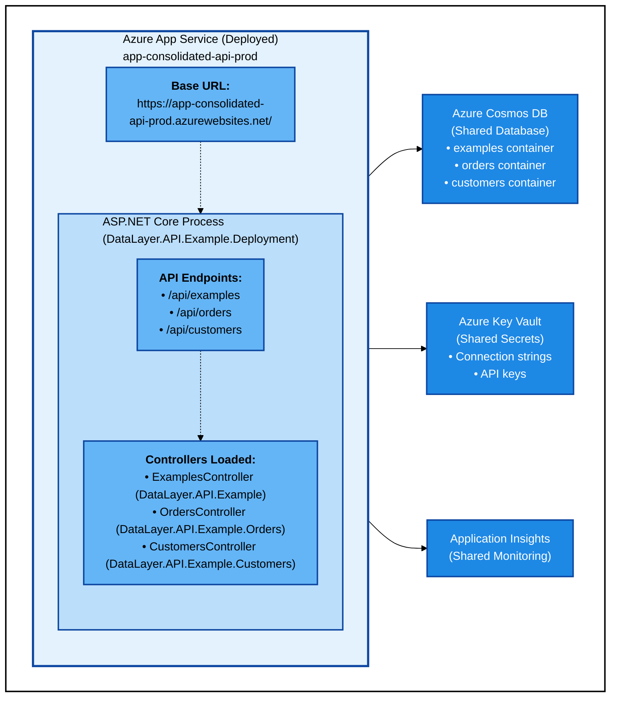

# Consolidated Deployment Architecture

## Document Information

**Date**: 2026-01-30  
**Status**: Proposed  
**Architecture Type**: Hybrid Model - Independent Development, Consolidated Deployment  
**Usage**: Deployment model for "lazy" APIs (low resource consumption) in production, and all APIs in non-production  
**Related Documentation**: 
- [Deployment Strategy](deployment-strategy.md) - **START HERE** - Overall strategic approach
- [ADR 0004: Progressive Deployment Strategy](adr/0004-progressive-deployment-strategy.md) - Evidence-based deployment approach
- [ADR 0005: Hybrid Production Architecture](adr/0005-hybrid-production-architecture.md) - Hybrid production deployment combining consolidated and independent
- [ADR 0001: Deploy Each Project as Independent Azure App Service](adr/0001-deploy-each-project-as-independent-app-service.md) - Independent deployment for greedy APIs
- [App Service Application Gateway Architecture](app-service-application-gateway-architecture.md) - Alternative architecture (not selected)
- [App Service Private Endpoint Architecture](app-service-private-endpoint-architecture.md) - Network architecture used by this deployment model
- [Azure Resource Requirements](azure-resource-requirements.md) - Infrastructure specifications

## Executive Summary

This document describes a hybrid architecture that enables independent API development while deploying all APIs as a single consolidated Azure App Service. This approach optimizes the developer experience (fast local development with isolated API projects) while maximizing deployment efficiency and cost savings in production (single App Service, single deployment pipeline).

**Key Characteristics**:
- **Development**: Each API project is fully runnable and independently testable
- **Deployment**: Single consolidated App Service hosting all APIs
- **CI/CD**: Centralized in deployment project
- **Cost**: Single App Service (~$75-200/month vs $750-2000/month for 10 independent services)
- **Performance**: Fast local F5 experience, only load what you're working on
- **Flexibility**: Can still deploy independently if requirements change

---

## Table of Contents

1. [Architecture Overview](#architecture-overview)
2. [Project Structure](#project-structure)
3. [Development Workflow](#development-workflow)
4. [Deployment Architecture](#deployment-architecture)
5. [CI/CD Pipeline](#cicd-pipeline)
6. [Configuration Management](#configuration-management)
7. [Pros and Cons](#pros-and-cons)
8. [Migration Path](#migration-path)
9. [Future Considerations](#future-considerations)

---

## Architecture Overview

### High-Level Architecture



### Core Principle

**Separation of Concerns**:
- **API Projects**: Own their controllers, services, entities, and business logic
- **Shared Project**: Common infrastructure (Cosmos DB extensions, base repositories, configuration)
- **Deployment Project**: Orchestrates loading all APIs and owns CI/CD configuration

---

## Project Structure

### Solution Organization

```
DataLayer.API.Example.sln
├── README.md
├── LICENSE
│
├── DataLayer.API.Example/                          # Examples API (Runnable)
│   ├── Program.cs                                # Standalone host
│   ├── appsettings.json
│   ├── appsettings.Development.json
│   ├── DataLayer.API.Example.csproj
│   ├── Controllers/
│   │   └── ExamplesController.cs
│   ├── Services/
│   │   ├── IExampleService.cs
│   │   └── ExampleService.cs
│   ├── Entities/
│   │   └── Example.cs
│   ├── Repositories/
│   │   └── ExampleRepository.cs
│   └── Extensions/
│       └── ExamplesServiceExtensions.cs          # DI registration for Examples module
│
├── DataLayer.API.Example.Orders/                   # Orders API (Runnable)
│   ├── Program.cs                                # Standalone host
│   ├── appsettings.json
│   ├── DataLayer.API.Example.Orders.csproj
│   ├── Controllers/
│   │   └── OrdersController.cs
│   ├── Services/
│   │   ├── IOrderService.cs
│   │   └── OrderService.cs
│   ├── Entities/
│   │   └── Order.cs
│   ├── Repositories/
│   │   └── OrderRepository.cs
│   └── Extensions/
│       └── OrdersServiceExtensions.cs            # DI registration for Orders module
│
├── DataLayer.API.Example.Customers/                # Customers API (Runnable)
│   ├── Program.cs
│   ├── appsettings.json
│   ├── DataLayer.API.Example.Customers.csproj
│   ├── Controllers/
│   ├── Services/
│   ├── Entities/
│   ├── Repositories/
│   └── Extensions/
│       └── CustomersServiceExtensions.cs
│
├── DataLayer.API.Example.Shared/                   # Shared Infrastructure (Class Library)
│   ├── DataLayer.API.Example.Shared.csproj
│   ├── Configuration/
│   │   └── CosmosDbConfig.cs
│   ├── Extensions/
│   │   ├── CosmosDbExtensions.cs
│   │   └── ServiceCollectionExtensions.cs
│   ├── Repositories/
│   │   ├── ICosmosDbRepository.cs
│   │   └── CosmosRepositoryBase.cs
│   └── Middleware/
│       ├── ErrorHandlingMiddleware.cs
│       └── LoggingMiddleware.cs
│
├── DataLayer.API.Example.Deployment/               # Consolidated Host (Runnable)
│   ├── Program.cs                                # Loads all APIs
│   ├── appsettings.json
│   ├── appsettings.Production.json
│   ├── DataLayer.API.Example.Deployment.csproj
│   ├── Properties/
│   │   └── launchSettings.json
│   │
│   ├── deployment-manifests/                     # Deployment topology definitions
│   │   ├── non-production.manifest.json          # Fully consolidated
│   │   └── production.manifest.json              # Hybrid (consolidated + independent)
│   │
│   ├── .github/                                  # CI/CD Configuration
│   │   └── workflows/
│   │       ├── deploy-production.yml
│   │       ├── deploy-non-production.yml
│   │       └── pr-validation.yml
│   │
│   ├── azure-pipelines/                          # Azure DevOps Pipelines (if used)
│   │   ├── azure-pipelines.yml
│   │   └── templates/
│   │       ├── build.yml
│   │       └── deploy.yml
│   │
│   ├── infrastructure/                           # Infrastructure as Code
│   │   ├── main.bicep                            # Orchestrator (reads manifest)
│   │   ├── modules/
│   │   │   ├── consolidated-app-service.bicep    # Module for consolidated deployment
│   │   │   ├── independent-app-service.bicep     # Module for independent deployment (reusable)
│   │   │   ├── shared-infrastructure.bicep       # Cosmos DB, Key Vault, App Insights
│   │   │   └── networking.bicep                  # VNet, subnets, Private DNS
│   │   └── parameters/
│   │       ├── common.bicepparam                 # Shared parameters (region, tags, etc.)
│   │       ├── non-production.bicepparam         # Environment-specific overrides
│   │       └── production.bicepparam             # Environment-specific overrides
│   │
│   └── scripts/
│       ├── deploy.ps1
│       ├── deploy.sh
│       └── validate-deployment.ps1
│
├── DataLayer.API.Example.UnitTests/                # Unit Tests
│   ├── Controllers/
│   ├── Services/
│   └── ...
│
└── DataLayer.API.Example.IntegrationTests/         # Integration Tests
    ├── Api/
    ├── TestBase/
    └── ...
```

### Project Dependencies

```
DataLayer.API.Example.Deployment
├── References:
│   ├── DataLayer.API.Example
│   ├── DataLayer.API.Example.Orders
│   ├── DataLayer.API.Example.Customers
│   └── DataLayer.API.Example.Shared

DataLayer.API.Example (Examples API)
├── References:
│   └── DataLayer.API.Example.Shared

DataLayer.API.Example.Orders
├── References:
│   └── DataLayer.API.Example.Shared

DataLayer.API.Example.Customers
├── References:
│   └── DataLayer.API.Example.Shared
```

---

## Development Workflow

### Local Development - Examples API

**Scenario**: Developer working on Examples API feature

```bash
# 1. Open solution in Visual Studio / VS Code / Rider
# 2. Set DataLayer.API.Example as startup project
# 3. Press F5

# Result: Only Examples API starts
# - URL: https://localhost:7001/api/examples
# - Fast startup (2-3 seconds)
# - Only Examples controllers and services loaded
# - Isolated debugging experience
```

**Program.cs** (DataLayer.API.Example/Program.cs):
```csharp
var builder = WebApplication.CreateBuilder(args);

// Add services for Examples API only
builder.Services.AddControllers();
builder.Services.AddExamplesServices(builder.Configuration);

// Shared services
builder.Services.AddApplicationInsights();
builder.Services.AddSwaggerGen();

var app = builder.Build();

app.UseSwagger();
app.UseSwaggerUI();
app.MapControllers();
app.Run();
```

### Local Development - Orders API

**Scenario**: Different developer working on Orders API

```bash
# 1. Set DataLayer.API.Example.Orders as startup project
# 2. Press F5

# Result: Only Orders API starts
# - URL: https://localhost:7002/api/orders
# - Independent from Examples API
# - Can run simultaneously on different ports
```

### Local Development - Full Stack Testing

**Scenario**: Testing interactions between multiple APIs

```bash
# 1. Set DataLayer.API.Example.Deployment as startup project
# 2. Press F5

# Result: ALL APIs start in single process
# - URL: https://localhost:7000
# - All endpoints available:
#   - /api/examples
#   - /api/orders
#   - /api/customers
# - Simulates production environment
```

**Program.cs** (DataLayer.API.Example.Deployment/Program.cs):
```csharp
var builder = WebApplication.CreateBuilder(args);

// Add controllers from all API projects
builder.Services.AddControllers()
    .AddApplicationPart(typeof(DataLayer.API.Example.Program).Assembly)
    .AddApplicationPart(typeof(DataLayer.API.Example.Orders.Program).Assembly)
    .AddApplicationPart(typeof(DataLayer.API.Example.Customers.Program).Assembly);

// Register services from all modules
builder.Services.AddExamplesServices(builder.Configuration);
builder.Services.AddOrdersServices(builder.Configuration);
builder.Services.AddCustomersServices(builder.Configuration);

// Shared services
builder.Services.AddApplicationInsights();
builder.Services.AddSwaggerGen(options =>
{
    options.SwaggerDoc("v1", new() { Title = "Consolidated API", Version = "v1" });
    options.TagActionsBy(api => new[] { api.GroupName ?? api.ActionDescriptor.RouteValues["controller"] });
});

var app = builder.Build();

app.UseSwagger();
app.UseSwaggerUI();
app.MapControllers();
app.Run();
```

### Service Registration Pattern

Each API project exposes a service registration extension method:

**DataLayer.API.Example/Extensions/ExamplesServiceExtensions.cs**:
```csharp
namespace DataLayer.API.Example.Extensions;

public static class ExamplesServiceExtensions
{
    public static IServiceCollection AddExamplesServices(
        this IServiceCollection services,
        IConfiguration configuration)
    {
        // Register Examples-specific services
        services.AddScoped<IExampleService, ExampleService>();
        services.AddScoped<ExampleRepository>();
        
        // Configure Cosmos DB for Examples
        services.AddCosmosDb(
            configuration.GetSection("CosmosDb:Examples"),
            containerName: "examples");
        
        return services;
    }
}
```

**DataLayer.API.Example.Orders/Extensions/OrdersServiceExtensions.cs**:
```csharp
namespace DataLayer.API.Example.Orders.Extensions;

public static class OrdersServiceExtensions
{
    public static IServiceCollection AddOrdersServices(
        this IServiceCollection services,
        IConfiguration configuration)
    {
        services.AddScoped<IOrderService, OrderService>();
        services.AddScoped<OrderRepository>();
        
        services.AddCosmosDb(
            configuration.GetSection("CosmosDb:Orders"),
            containerName: "orders");
        
        return services;
    }
}
```

---

## Deployment Architecture

### Deployed Environment

**Single App Service** hosting all APIs:



### Network Architecture Options

The deployment project supports all previously documented network architectures:

#### Option A: Private Endpoint Only
```
On-Premises → VPN Gateway → Private Endpoint → App Service (Consolidated)
```

#### Option B: Application Gateway
```
On-Premises → VPN Gateway → Application Gateway → App Service (Consolidated)
```

**Key Difference**: Instead of routing to 10 separate App Services, gateway routes to different paths within the same App Service.

### Deployment Sizing

**Resource Requirements** (10+ APIs consolidated):

| Resource | Tier | Instances | Monthly Cost (USD) |
|----------|------|-----------|-------------------|
| App Service Plan | P1V3 Premium | 1-2 | $150-300 |
| Cosmos DB | Serverless | 1 | $25-100 |
| Key Vault | Standard | 1 | $5 |
| Application Insights | Pay-as-you-go | 1 | $10-50 |
| **Total** | | | **$190-455/month** |

**Comparison**:
- **Independent App Services** (10 APIs): $750-2000/month
- **Consolidated Deployment**: $190-455/month
- **Savings**: $560-1545/month (74-77% reduction)

---

## CI/CD Pipeline

### Pipeline Strategy

All CI/CD configuration resides in `DataLayer.API.Example.Deployment` project.

### GitHub Actions Workflow

**File**: `DataLayer.API.Example.Deployment/.github/workflows/deploy-production.yml`

```yaml
name: Deploy to Production

on:
  push:
    branches:
      - main
  workflow_dispatch:

env:
  DOTNET_VERSION: '8.0.x'
  AZURE_WEBAPP_NAME: 'app-consolidated-api-prod'

jobs:
  build:
    runs-on: ubuntu-latest
    
    steps:
    - name: Checkout code
      uses: actions/checkout@v4
    
    - name: Setup .NET
      uses: actions/setup-dotnet@v4
      with:
        dotnet-version: ${{ env.DOTNET_VERSION }}
    
    - name: Restore dependencies
      run: dotnet restore DataLayer.API.Example.sln
    
    - name: Build solution
      run: dotnet build DataLayer.API.Example.sln --configuration Release --no-restore
    
    - name: Run unit tests
      run: dotnet test DataLayer.API.Example.UnitTests/DataLayer.API.Example.UnitTests.csproj --no-build --configuration Release
    
    - name: Run integration tests
      run: dotnet test DataLayer.API.Example.IntegrationTests/DataLayer.API.Example.IntegrationTests.csproj --no-build --configuration Release
    
    - name: Publish deployment project
      run: dotnet publish DataLayer.API.Example.Deployment/DataLayer.API.Example.Deployment.csproj --configuration Release --output ./publish
    
    - name: Upload artifact
      uses: actions/upload-artifact@v4
      with:
        name: deployment-package
        path: ./publish

  deploy-infrastructure:
    runs-on: ubuntu-latest
    needs: build
    
    steps:
    - name: Checkout code
      uses: actions/checkout@v4
    
    - name: Azure Login
      uses: azure/login@v2
      with:
        creds: ${{ secrets.AZURE_CREDENTIALS }}
    
    - name: Deploy Bicep infrastructure
      uses: azure/arm-deploy@v2
      with:
        subscriptionId: ${{ secrets.AZURE_SUBSCRIPTION_ID }}
        resourceGroupName: rg-consolidated-api-prod
        template: ./DataLayer.API.Example.Deployment/infrastructure/main.bicep
        parameters: ./DataLayer.API.Example.Deployment/infrastructure/parameters/production.bicepparam

  deploy-app:
    runs-on: ubuntu-latest
    needs: [build, deploy-infrastructure]
    
    steps:
    - name: Download artifact
      uses: actions/download-artifact@v4
      with:
        name: deployment-package
        path: ./publish
    
    - name: Azure Login
      uses: azure/login@v2
      with:
        creds: ${{ secrets.AZURE_CREDENTIALS }}
    
    - name: Deploy to Azure App Service
      uses: azure/webapps-deploy@v3
      with:
        app-name: ${{ env.AZURE_WEBAPP_NAME }}
        package: ./publish
    
    - name: Run smoke tests
      run: |
        # Wait for deployment to stabilize
        sleep 30
        
        # Test Examples API
        curl -f https://${{ env.AZURE_WEBAPP_NAME }}.azurewebsites.net/api/examples/health || exit 1
        
        # Test Orders API
        curl -f https://${{ env.AZURE_WEBAPP_NAME }}.azurewebsites.net/api/orders/health || exit 1
        
        # Test Customers API
        curl -f https://${{ env.AZURE_WEBAPP_NAME }}.azurewebsites.net/api/customers/health || exit 1
```

### Pull Request Validation

**File**: `DataLayer.API.Example.Deployment/.github/workflows/pr-validation.yml`

```yaml
name: PR Validation

on:
  pull_request:
    branches:
      - main

jobs:
  validate:
    runs-on: ubuntu-latest
    
    steps:
    - name: Checkout code
      uses: actions/checkout@v4
    
    - name: Setup .NET
      uses: actions/setup-dotnet@v4
      with:
        dotnet-version: '8.0.x'
    
    - name: Restore dependencies
      run: dotnet restore DataLayer.API.Example.sln
    
    - name: Build solution
      run: dotnet build DataLayer.API.Example.sln --configuration Release --no-restore
    
    - name: Run all tests
      run: dotnet test DataLayer.API.Example.sln --no-build --configuration Release --logger "trx;LogFileName=test-results.trx"
    
    - name: Publish test results
      uses: dorny/test-reporter@v1
      if: always()
      with:
        name: Test Results
        path: '**/test-results.trx'
        reporter: dotnet-trx
    
    - name: Validate Bicep
      run: |
        az bicep build --file ./DataLayer.API.Example.Deployment/infrastructure/main.bicep
```

### Infrastructure as Code

**File**: `DataLayer.API.Example.Deployment/infrastructure/main.bicep`

```bicep
@description('Environment name (e.g., prod, staging)')
param environmentName string = 'prod'

@description('Azure region for resources')
param location string = resourceGroup().location

@description('App Service Plan SKU')
param appServicePlanSku string = 'P1V3'

// App Service Plan
module appServicePlan 'modules/app-service-plan.bicep' = {
  name: 'asp-consolidated-api-${environmentName}'
  params: {
    name: 'asp-consolidated-api-${environmentName}'
    location: location
    sku: appServicePlanSku
  }
}

// App Service (Consolidated)
module appService 'modules/app-service.bicep' = {
  name: 'app-consolidated-api-${environmentName}'
  params: {
    name: 'app-consolidated-api-${environmentName}'
    location: location
    appServicePlanId: appServicePlan.outputs.id
    appSettings: [
      {
        name: 'APPLICATIONINSIGHTS_CONNECTION_STRING'
        value: applicationInsights.outputs.connectionString
      }
      {
        name: 'CosmosDb__AccountEndpoint'
        value: cosmosDb.outputs.endpoint
      }
    ]
  }
}

// Cosmos DB
module cosmosDb 'modules/cosmos-db.bicep' = {
  name: 'cosmos-consolidated-api-${environmentName}'
  params: {
    name: 'cosmos-consolidated-api-${environmentName}'
    location: location
    containers: [
      { name: 'examples', partitionKey: '/id' }
      { name: 'orders', partitionKey: '/customerId' }
      { name: 'customers', partitionKey: '/id' }
    ]
  }
}

// Application Insights
module applicationInsights 'modules/application-insights.bicep' = {
  name: 'appi-consolidated-api-${environmentName}'
  params: {
    name: 'appi-consolidated-api-${environmentName}'
    location: location
  }
}

// Key Vault
module keyVault 'modules/key-vault.bicep' = {
  name: 'kv-consolidated-api-${environmentName}'
  params: {
    name: 'kv-api-${environmentName}-${uniqueString(resourceGroup().id)}'
    location: location
    appServicePrincipalId: appService.outputs.principalId
  }
}

output appServiceUrl string = appService.outputs.defaultHostName
```

---

## Infrastructure Management Strategy

### Challenge: Different Infrastructure Topologies

The infrastructure requirements differ significantly between environments:

**Non-Production (Fully Consolidated)**:
- 1 App Service Plan
- 1 App Service (hosting all APIs)
- 1 Private Endpoint
- Shared resources (Cosmos DB, Key Vault, Application Insights)

**Production (Hybrid Example: 8 lazy + 2 greedy)**:
- 3 App Service Plans (1 consolidated + 2 for greedy APIs)
- 3 App Services (1 consolidated + 2 independent)
- 3 Private Endpoints (1 per App Service)
- Same shared resources

**Key Insight**: This is not just a parameter difference - it's a structural difference. Parameter files alone cannot handle deploying 1 vs 3 App Services.

### Solution: Deployment Manifests + Bicep Conditionals

#### Approach 1: Deployment Manifest as Input (Recommended)

**File**: `deployment-manifests/non-production.manifest.json`

```json
{
  "environment": "non-production",
  "deploymentStrategy": "fully-consolidated",
  "consolidated": {
    "appServicePlan": {
      "name": "asp-consolidated-api-nonprod",
      "sku": "P1V3",
      "minInstances": 2,
      "maxInstances": 5
    },
    "appService": {
      "name": "app-consolidated-api-nonprod"
    },
    "privateEndpoint": {
      "name": "pe-consolidated-api-nonprod"
    },
    "apis": [
      "DataLayer.API.Example",
      "DataLayer.API.Example.Orders",
      "DataLayer.API.Example.Customers"
    ]
  },
  "independent": []
}
```

**File**: `deployment-manifests/production.manifest.json`

```json
{
  "environment": "production",
  "deploymentStrategy": "hybrid",
  "consolidated": {
    "appServicePlan": {
      "name": "asp-consolidated-api-prod",
      "sku": "P1V3",
      "minInstances": 2,
      "maxInstances": 5
    },
    "appService": {
      "name": "app-consolidated-api-prod"
    },
    "privateEndpoint": {
      "name": "pe-consolidated-api-prod"
    },
    "apis": [
      "DataLayer.API.Example",
      "DataLayer.API.Example.Products",
      "DataLayer.API.Example.Categories",
      "DataLayer.API.Example.Suppliers",
      "DataLayer.API.Example.Reports",
      "DataLayer.API.Example.Analytics",
      "DataLayer.API.Example.Notifications",
      "DataLayer.API.Example.Settings"
    ]
  },
  "independent": [
    {
      "api": "DataLayer.API.Example.Orders",
      "appServicePlan": {
        "name": "asp-orders-api-prod",
        "sku": "P1V3",
        "minInstances": 2,
        "maxInstances": 10
      },
      "appService": {
        "name": "app-orders-api-prod"
      },
      "privateEndpoint": {
        "name": "pe-orders-api-prod"
      },
      "reason": "Greedy API - High CPU (75%), high request rate (5000/min)"
    },
    {
      "api": "DataLayer.API.Example.Customers",
      "appServicePlan": {
        "name": "asp-customers-api-prod",
        "sku": "P1V3",
        "minInstances": 2,
        "maxInstances": 8
      },
      "appService": {
        "name": "app-customers-api-prod"
      },
      "privateEndpoint": {
        "name": "pe-customers-api-prod"
      },
      "reason": "Greedy API - High CPU (68%), high memory (72%)"
    }
  ]
}
```

#### Updated Bicep Template (Manifest-Driven)

**File**: `infrastructure/main.bicep`

```bicep
@description('Path to deployment manifest JSON file')
param manifestPath string

@description('Azure region for resources')
param location string = resourceGroup().location

// Load deployment manifest
var manifest = loadJsonContent(manifestPath)
var environmentName = manifest.environment

// Shared Infrastructure Module
module sharedInfra 'modules/shared-infrastructure.bicep' = {
  name: 'shared-infrastructure'
  params: {
    environment: environmentName
    location: location
  }
}

// Networking Module
module networking 'modules/networking.bicep' = {
  name: 'networking'
  params: {
    environment: environmentName
    location: location
  }
}

// Consolidated App Service Module
module consolidatedDeployment 'modules/consolidated-app-service.bicep' = {
  name: 'consolidated-deployment'
  params: {
    environment: environmentName
    location: location
    config: manifest.consolidated
    vnetIntegrationSubnetId: networking.outputs.vnetIntegrationSubnetId
    privateEndpointSubnetId: networking.outputs.privateEndpointSubnetId
    cosmosDbConnectionString: sharedInfra.outputs.cosmosDbConnectionString
    keyVaultUri: sharedInfra.outputs.keyVaultUri
    appInsightsConnectionString: sharedInfra.outputs.appInsightsConnectionString
  }
}

// Independent App Services Module (loops over manifest.independent array)
module independentDeployments 'modules/independent-app-service.bicep' = [for (api, i) in manifest.independent: {
  name: 'independent-deployment-${i}'
  params: {
    environment: environmentName
    location: location
    config: api
    vnetIntegrationSubnetId: networking.outputs.vnetIntegrationSubnetId
    privateEndpointSubnetId: networking.outputs.privateEndpointSubnetId
    cosmosDbConnectionString: sharedInfra.outputs.cosmosDbConnectionString
    keyVaultUri: sharedInfra.outputs.keyVaultUri
    appInsightsConnectionString: sharedInfra.outputs.appInsightsConnectionString
  }
}]

// Outputs
output consolidatedAppServiceUrl string = consolidatedDeployment.outputs.appServiceUrl
output independentAppServiceUrls array = [for (api, i) in manifest.independent: independentDeployments[i].outputs.appServiceUrl]
```

**File**: `infrastructure/modules/consolidated-app-service.bicep`

```bicep
param environment string
param location string
param config object
param vnetIntegrationSubnetId string
param privateEndpointSubnetId string
param cosmosDbConnectionString string
param keyVaultUri string
param appInsightsConnectionString string

// App Service Plan
resource appServicePlan 'Microsoft.Web/serverfarms@2023-01-01' = {
  name: config.appServicePlan.name
  location: location
  sku: {
    name: config.appServicePlan.sku
    tier: 'PremiumV3'
    capacity: config.appServicePlan.minInstances
  }
  properties: {
    reserved: false
  }
  tags: {
    environment: environment
    deploymentType: 'consolidated'
  }
}

// Auto-scale Settings
resource autoScaleSettings 'Microsoft.Insights/autoscalesettings@2022-10-01' = {
  name: '${config.appServicePlan.name}-autoscale'
  location: location
  properties: {
    enabled: true
    targetResourceUri: appServicePlan.id
    profiles: [
      {
        name: 'Auto scale based on CPU and Memory'
        capacity: {
          minimum: string(config.appServicePlan.minInstances)
          maximum: string(config.appServicePlan.maxInstances)
          default: string(config.appServicePlan.minInstances)
        }
        rules: [
          {
            scaleAction: {
              direction: 'Increase'
              type: 'ChangeCount'
              value: '1'
              cooldown: 'PT5M'
            }
            metricTrigger: {
              metricName: 'CpuPercentage'
              metricResourceUri: appServicePlan.id
              operator: 'GreaterThan'
              statistic: 'Average'
              threshold: 70
              timeAggregation: 'Average'
              timeGrain: 'PT1M'
              timeWindow: 'PT5M'
            }
          }
          {
            scaleAction: {
              direction: 'Decrease'
              type: 'ChangeCount'
              value: '1'
              cooldown: 'PT10M'
            }
            metricTrigger: {
              metricName: 'CpuPercentage'
              metricResourceUri: appServicePlan.id
              operator: 'LessThan'
              statistic: 'Average'
              threshold: 30
              timeAggregation: 'Average'
              timeGrain: 'PT1M'
              timeWindow: 'PT10M'
            }
          }
        ]
      }
    ]
  }
}

// App Service
resource appService 'Microsoft.Web/sites@2023-01-01' = {
  name: config.appService.name
  location: location
  identity: {
    type: 'SystemAssigned'
  }
  properties: {
    serverFarmId: appServicePlan.id
    httpsOnly: true
    publicNetworkAccess: 'Disabled'
    virtualNetworkSubnetId: vnetIntegrationSubnetId
    siteConfig: {
      netFrameworkVersion: 'v8.0'
      alwaysOn: true
      ftpsState: 'Disabled'
      minTlsVersion: '1.2'
      appSettings: [
        {
          name: 'APPLICATIONINSIGHTS_CONNECTION_STRING'
          value: appInsightsConnectionString
        }
        {
          name: 'ApplicationInsightsAgent_EXTENSION_VERSION'
          value: '~3'
        }
        {
          name: 'CosmosDb__ConnectionString'
          value: '@Microsoft.KeyVault(VaultName=${keyVaultUri};SecretName=cosmos-connection-string)'
        }
        {
          name: 'DeploymentType'
          value: 'Consolidated'
        }
        {
          name: 'LoadedAPIs'
          value: join(config.apis, ',')
        }
      ]
    }
  }
  tags: {
    environment: environment
    deploymentType: 'consolidated'
    apiCount: string(length(config.apis))
  }
}

// Private Endpoint
resource privateEndpoint 'Microsoft.Network/privateEndpoints@2023-04-01' = {
  name: config.privateEndpoint.name
  location: location
  properties: {
    subnet: {
      id: privateEndpointSubnetId
    }
    privateLinkServiceConnections: [
      {
        name: config.privateEndpoint.name
        properties: {
          privateLinkServiceId: appService.id
          groupIds: [
            'sites'
          ]
        }
      }
    ]
  }
  tags: {
    environment: environment
    deploymentType: 'consolidated'
  }
}

output appServiceUrl string = appService.properties.defaultHostName
output appServiceId string = appService.id
output principalId string = appService.identity.principalId
output privateEndpointIp string = privateEndpoint.properties.customDnsConfigs[0].ipAddresses[0]
```

**File**: `infrastructure/modules/independent-app-service.bicep`

```bicep
param environment string
param location string
param config object
param vnetIntegrationSubnetId string
param privateEndpointSubnetId string
param cosmosDbConnectionString string
param keyVaultUri string
param appInsightsConnectionString string

// App Service Plan (dedicated for this API)
resource appServicePlan 'Microsoft.Web/serverfarms@2023-01-01' = {
  name: config.appServicePlan.name
  location: location
  sku: {
    name: config.appServicePlan.sku
    tier: 'PremiumV3'
    capacity: config.appServicePlan.minInstances
  }
  properties: {
    reserved: false
  }
  tags: {
    environment: environment
    deploymentType: 'independent'
    api: config.api
  }
}

// Auto-scale Settings (custom per API)
resource autoScaleSettings 'Microsoft.Insights/autoscalesettings@2022-10-01' = {
  name: '${config.appServicePlan.name}-autoscale'
  location: location
  properties: {
    enabled: true
    targetResourceUri: appServicePlan.id
    profiles: [
      {
        name: 'Auto scale for ${config.api}'
        capacity: {
          minimum: string(config.appServicePlan.minInstances)
          maximum: string(config.appServicePlan.maxInstances)
          default: string(config.appServicePlan.minInstances)
        }
        rules: [
          // Custom scaling rules per API requirements
          {
            scaleAction: {
              direction: 'Increase'
              type: 'ChangeCount'
              value: '1'
              cooldown: 'PT3M'
            }
            metricTrigger: {
              metricName: 'CpuPercentage'
              metricResourceUri: appServicePlan.id
              operator: 'GreaterThan'
              statistic: 'Average'
              threshold: 75
              timeAggregation: 'Average'
              timeGrain: 'PT1M'
              timeWindow: 'PT5M'
            }
          }
        ]
      }
    ]
  }
}

// App Service (single API only)
resource appService 'Microsoft.Web/sites@2023-01-01' = {
  name: config.appService.name
  location: location
  identity: {
    type: 'SystemAssigned'
  }
  properties: {
    serverFarmId: appServicePlan.id
    httpsOnly: true
    publicNetworkAccess: 'Disabled'
    virtualNetworkSubnetId: vnetIntegrationSubnetId
    siteConfig: {
      netFrameworkVersion: 'v8.0'
      alwaysOn: true
      ftpsState: 'Disabled'
      minTlsVersion: '1.2'
      appSettings: [
        {
          name: 'APPLICATIONINSIGHTS_CONNECTION_STRING'
          value: appInsightsConnectionString
        }
        {
          name: 'ApplicationInsightsAgent_EXTENSION_VERSION'
          value: '~3'
        }
        {
          name: 'CosmosDb__ConnectionString'
          value: '@Microsoft.KeyVault(VaultName=${keyVaultUri};SecretName=cosmos-connection-string)'
        }
        {
          name: 'DeploymentType'
          value: 'Independent'
        }
        {
          name: 'API'
          value: config.api
        }
        {
          name: 'IsolationReason'
          value: config.reason
        }
      ]
    }
  }
  tags: {
    environment: environment
    deploymentType: 'independent'
    api: config.api
    isolationReason: config.reason
  }
}

// Private Endpoint
resource privateEndpoint 'Microsoft.Network/privateEndpoints@2023-04-01' = {
  name: config.privateEndpoint.name
  location: location
  properties: {
    subnet: {
      id: privateEndpointSubnetId
    }
    privateLinkServiceConnections: [
      {
        name: config.privateEndpoint.name
        properties: {
          privateLinkServiceId: appService.id
          groupIds: [
            'sites'
          ]
        }
      }
    ]
  }
  tags: {
    environment: environment
    deploymentType: 'independent'
    api: config.api
  }
}

output appServiceUrl string = appService.properties.defaultHostName
output appServiceId string = appService.id
output principalId string = appService.identity.principalId
output privateEndpointIp string = privateEndpoint.properties.customDnsConfigs[0].ipAddresses[0]
```

#### Deployment Command

```bash
# Non-Production (Fully Consolidated)
az deployment group create \
  --resource-group rg-apis-nonprod \
  --template-file infrastructure/main.bicep \
  --parameters \
    manifestPath='deployment-manifests/non-production.manifest.json' \
    location='eastus'

# Production (Hybrid)
az deployment group create \
  --resource-group rg-apis-prod \
  --template-file infrastructure/main.bicep \
  --parameters \
    manifestPath='deployment-manifests/production.manifest.json' \
    location='eastus'
```

### Benefits of Manifest-Driven Approach

1. **Single Source of Truth**: Manifest file defines complete deployment topology
2. **Environment Flexibility**: Same Bicep templates work for any environment
3. **Easy Reclassification**: Move API from consolidated to independent by editing manifest
4. **Version Control**: Manifest changes tracked in git with full history
5. **Auditability**: Clear documentation of why each API is deployed where
6. **CI/CD Integration**: Pipelines can read manifest to determine deployment strategy

### Alternative Approach: Conditional Deployment with Parameters

If you prefer not to use manifests, you can use Bicep conditionals:

```bicep
@description('Number of independent APIs to deploy')
param independentApiCount int = 0

@description('Independent API configurations (empty for non-production)')
param independentApis array = []

// Consolidated deployment always exists
module consolidatedDeployment 'modules/consolidated-app-service.bicep' = {
  // ... configuration
}

// Independent deployments only if count > 0
module independentDeployments 'modules/independent-app-service.bicep' = [for (api, i) in independentApis: if (independentApiCount > 0) {
  // ... configuration
}]
```

**Non-Production Parameters**:
```bicepparam
using './main.bicep'

param independentApiCount = 0
param independentApis = []
```

**Production Parameters**:
```bicepparam
using './main.bicep'

param independentApiCount = 2
param independentApis = [
  {
    name: 'orders'
    sku: 'P1V3'
    // ... config
  }
  {
    name: 'customers'
    sku: 'P1V3'
    // ... config
  }
]
```

### Recommendation

**Use the Manifest-Driven Approach** for these reasons:
1. More maintainable (easier to understand topology at a glance)
2. Better documentation (manifest is self-documenting)
3. Easier to extend (add new independent APIs without touching Bicep)
4. Aligns with ADR 0005 deployment manifest design

---

## Configuration Management

### Environment-Specific Configuration

**Development** (DataLayer.API.Example/appsettings.Development.json):
```json
{
  "Logging": {
    "LogLevel": {
      "Default": "Information",
      "Microsoft.AspNetCore": "Warning"
    }
  },
  "CosmosDb": {
    "Examples": {
      "AccountEndpoint": "https://localhost:8081",
      "DatabaseName": "examples-dev",
      "ContainerName": "examples"
    }
  }
}
```

**Production** (DataLayer.API.Example.Deployment/appsettings.Production.json):
```json
{
  "Logging": {
    "LogLevel": {
      "Default": "Warning",
      "Microsoft.AspNetCore": "Warning"
    }
  },
  "CosmosDb": {
    "Examples": {
      "AccountEndpoint": "https://cosmos-consolidated-api-prod.documents.azure.com",
      "DatabaseName": "production",
      "ContainerName": "examples"
    },
    "Orders": {
      "AccountEndpoint": "https://cosmos-consolidated-api-prod.documents.azure.com",
      "DatabaseName": "production",
      "ContainerName": "orders"
    },
    "Customers": {
      "AccountEndpoint": "https://cosmos-consolidated-api-prod.documents.azure.com",
      "DatabaseName": "production",
      "ContainerName": "customers"
    }
  },
  "ApplicationInsights": {
    "ConnectionString": "@Microsoft.KeyVault(SecretUri=https://kv-api-prod.vault.azure.net/secrets/appinsights-connection-string)"
  }
}
```

### Shared Configuration

**DataLayer.API.Example.Shared/Configuration/CosmosDbConfig.cs**:
```csharp
namespace DataLayer.API.Example.Shared.Configuration;

public class CosmosDbConfig
{
    public string AccountEndpoint { get; set; } = string.Empty;
    public string DatabaseName { get; set; } = string.Empty;
    public string ContainerName { get; set; } = string.Empty;
}
```

---

## Pros and Cons

### Advantages ✅

#### Development Experience
- **Fast F5 Experience**: Developers only load the API they're working on
- **Isolated Testing**: Test one domain at a time without interference
- **Independent Development**: Teams can work on different APIs without conflicts
- **Familiar Workflow**: Maintains current project-per-API structure

#### Deployment Benefits
- **Single Deployment**: One App Service, one deployment pipeline
- **Cost Efficiency**: 74-77% cost reduction vs independent services
- **Simplified Operations**: One app to monitor, scale, and maintain
- **Shared Resources**: Single Application Insights, Key Vault, connection pools

#### Architecture Flexibility
- **Migration Path**: Can split into microservices later if needed
- **Gradual Adoption**: Can deploy some APIs independently, others consolidated
- **Network Options**: Works with both Private Endpoint and Application Gateway architectures

#### Code Quality
- **Clear Boundaries**: Each API project owns its domain
- **Shared Infrastructure**: Common code in Shared project reduces duplication
- **Testability**: Unit and integration tests remain isolated per API

### Disadvantages ❌

#### Deployment Coupling
- **All-or-Nothing Deployment**: All APIs deploy together (mitigated by App Service A/B deployment slots for zero-downtime deployments)
- **Shared Failure Domain**: One API crash can affect others (mitigated by process isolation in .NET)
- **Version Synchronization**: All APIs must be compatible with shared dependencies

#### Scaling Limitations
- **No Independent Auto-Scaling**: Cannot auto-scale one API without scaling all (mitigated by ability to deploy any individual API to a separate App Service if needed to isolate "greedy" APIs)
- **Resource Sharing**: High load on one API affects others
- **Less Granular Metrics**: Harder to attribute costs/usage to individual APIs

#### Code Management
- **Multiple Program.cs**: Slight duplication of host setup code
- **Build Complexity**: Must ensure deployment project includes all dependencies
- **Testing Coordination**: Integration tests should test consolidated deployment

#### Team Coordination
- **Merge Conflicts**: More likely when multiple teams work on solution
- **Release Coordination**: Teams must coordinate release timing
- **Debugging Complexity**: Production issues may span multiple API domains

---

## Migration Path

### Phase 1: Prepare Shared Infrastructure

**Goal**: Extract common code into shared project

```bash
# 1. Create shared project
dotnet new classlib -n DataLayer.API.Example.Shared

# 2. Move shared code
# Move to Shared:
# - CosmosDbExtensions
# - CosmosRepositoryBase
# - ICosmosDbRepository
# - CosmosDbConfig
# - ServiceCollectionExtensions (base)

# 3. Update project references
# DataLayer.API.Example → Reference → DataLayer.API.Example.Shared
```

### Phase 2: Create Service Extension Methods

**Goal**: Each API exposes a service registration extension

```csharp
// DataLayer.API.Example/Extensions/ExamplesServiceExtensions.cs
public static class ExamplesServiceExtensions
{
    public static IServiceCollection AddExamplesServices(
        this IServiceCollection services,
        IConfiguration configuration)
    {
        // Register Examples-specific services
        services.AddScoped<IExampleService, ExampleService>();
        services.AddScoped<ExampleRepository>();
        services.AddCosmosDb(configuration.GetSection("CosmosDb:Examples"), "examples");
        return services;
    }
}

// Update Program.cs to use it
builder.Services.AddExamplesServices(builder.Configuration);
```

### Phase 3: Create Deployment Project

```bash
# 1. Create deployment project
dotnet new web -n DataLayer.API.Example.Deployment

# 2. Add project references
cd DataLayer.API.Example.Deployment
dotnet add reference ../DataLayer.API.Example/DataLayer.API.Example.csproj
dotnet add reference ../DataLayer.API.Example.Orders/DataLayer.API.Example.Orders.csproj
dotnet add reference ../DataLayer.API.Example.Customers/DataLayer.API.Example.Customers.csproj
dotnet add reference ../DataLayer.API.Example.Shared/DataLayer.API.Example.Shared.csproj

# 3. Create consolidated Program.cs (see example above)
```

### Phase 4: Setup CI/CD

```bash
# 1. Create directory structure
mkdir -p DataLayer.API.Example.Deployment/.github/workflows
mkdir -p DataLayer.API.Example.Deployment/infrastructure/modules
mkdir -p DataLayer.API.Example.Deployment/infrastructure/parameters

# 2. Create workflow files (see CI/CD section above)

# 3. Create Bicep infrastructure files (see Infrastructure as Code section)
```

### Phase 5: Test and Validate

```bash
# 1. Test local development
# Set DataLayer.API.Example as startup project
dotnet run --project DataLayer.API.Example
# Verify Examples API works in isolation

# 2. Test consolidated deployment
# Set DataLayer.API.Example.Deployment as startup project
dotnet run --project DataLayer.API.Example.Deployment
# Verify all APIs work together

# 3. Run all tests
dotnet test DataLayer.API.Example.sln

# 4. Test deployment to Azure
# Deploy to non-production environment first
# Run smoke tests
# Validate all APIs are accessible
```

### Phase 6: Production Deployment

```bash
# 1. Deploy infrastructure
az deployment group create \
  --resource-group rg-consolidated-api-prod \
  --template-file DataLayer.API.Example.Deployment/infrastructure/main.bicep \
  --parameters DataLayer.API.Example.Deployment/infrastructure/parameters/production.bicepparam

# 2. Deploy application via CI/CD pipeline
# Push to main branch triggers deployment

# 3. Verify deployment
curl https://app-consolidated-api-prod.azurewebsites.net/api/examples
curl https://app-consolidated-api-prod.azurewebsites.net/api/orders
curl https://app-consolidated-api-prod.azurewebsites.net/api/customers

# 4. Monitor Application Insights for errors
```

---

## Future Considerations

### When to Consider Splitting

Evaluate splitting consolidated deployment if:

1. **Performance Bottlenecks**: One API's load significantly impacts others
2. **Independent Scaling Needs**: Specific APIs need different scaling profiles
3. **Team Growth**: Multiple teams need full deployment independence
4. **Security Requirements**: Specific APIs require isolated network/security boundaries
5. **Technology Divergence**: Different APIs need different .NET versions or runtimes

### Migration to Microservices

The hybrid architecture provides a clean migration path:

```
Current State:
└── DataLayer.API.Example.Deployment (Consolidated)
    ├── DataLayer.API.Example
    ├── DataLayer.API.Example.Orders
    └── DataLayer.API.Example.Customers

Future State (if needed):
├── Independent App Service: DataLayer.API.Example (Examples)
├── Independent App Service: DataLayer.API.Example.Orders
└── DataLayer.API.Example.Deployment (Remaining APIs)
    └── DataLayer.API.Example.Customers
```

**Migration Steps**:
1. API project already has standalone `Program.cs` (no code changes needed)
2. Create dedicated App Service for the API
3. Update CI/CD to deploy that API independently
4. Remove API reference from Deployment project
5. Update routing (Application Gateway or client DLL)

### Container-Based Future

The architecture also supports containerization:

```dockerfile
# Dockerfile for Consolidated Deployment
FROM mcr.microsoft.com/dotnet/aspnet:8.0 AS base
WORKDIR /app
EXPOSE 80

FROM mcr.microsoft.com/dotnet/sdk:8.0 AS build
WORKDIR /src
COPY ["DataLayer.API.Example.Deployment/DataLayer.API.Example.Deployment.csproj", "DataLayer.API.Example.Deployment/"]
COPY ["DataLayer.API.Example/DataLayer.API.Example.csproj", "DataLayer.API.Example/"]
COPY ["DataLayer.API.Example.Orders/DataLayer.API.Example.Orders.csproj", "DataLayer.API.Example.Orders/"]
COPY ["DataLayer.API.Example.Customers/DataLayer.API.Example.Customers.csproj", "DataLayer.API.Example.Customers/"]
COPY ["DataLayer.API.Example.Shared/DataLayer.API.Example.Shared.csproj", "DataLayer.API.Example.Shared/"]

RUN dotnet restore "DataLayer.API.Example.Deployment/DataLayer.API.Example.Deployment.csproj"
COPY . .
WORKDIR "/src/DataLayer.API.Example.Deployment"
RUN dotnet build "DataLayer.API.Example.Deployment.csproj" -c Release -o /app/build

FROM build AS publish
RUN dotnet publish "DataLayer.API.Example.Deployment.csproj" -c Release -o /app/publish

FROM base AS final
WORKDIR /app
COPY --from=publish /app/publish .
ENTRYPOINT ["dotnet", "DataLayer.API.Example.Deployment.dll"]
```

Deploy to:
- **Azure Container Apps**: Serverless container hosting
- **Azure Kubernetes Service (AKS)**: Full orchestration with Kubernetes
- **Azure App Service (Containers)**: Current App Service with container support

---

## References

### Related Architecture Documents
- [App Service Application Gateway Architecture](app-service-application-gateway-architecture.md)
- [App Service Private Endpoint Architecture](app-service-private-endpoint-architecture.md)
- [ADR 0001: Deploy Each Project as Independent Azure App Service](adr/0001-deploy-each-project-as-independent-app-service.md)

### Microsoft Documentation
- [ASP.NET Core Application Parts](https://learn.microsoft.com/aspnet/core/mvc/advanced/app-parts)
- [.NET Application Architecture Guide](https://learn.microsoft.com/dotnet/architecture/)
- [Modular Monolith Architecture](https://learn.microsoft.com/dotnet/architecture/modern-web-apps-azure/common-web-application-architectures#modular-monoliths)
- [Azure App Service Deployment](https://learn.microsoft.com/azure/app-service/deploy-best-practices)
- [GitHub Actions for Azure](https://learn.microsoft.com/azure/developer/github/github-actions)

### Best Practices
- [ASP.NET Core Performance Best Practices](https://learn.microsoft.com/aspnet/core/performance/performance-best-practices)
- [Dependency Injection in .NET](https://learn.microsoft.com/dotnet/core/extensions/dependency-injection)
- [Configuration in ASP.NET Core](https://learn.microsoft.com/aspnet/core/fundamentals/configuration/)
- [Logging in .NET Core and ASP.NET Core](https://learn.microsoft.com/aspnet/core/fundamentals/logging/)

---

## Appendix A: Sample launchSettings.json

**DataLayer.API.Example.Deployment/Properties/launchSettings.json**:
```json
{
  "profiles": {
    "All APIs (Consolidated)": {
      "commandName": "Project",
      "dotnetRunMessages": true,
      "launchBrowser": true,
      "launchUrl": "swagger",
      "applicationUrl": "https://localhost:7000;http://localhost:5000",
      "environmentVariables": {
        "ASPNETCORE_ENVIRONMENT": "Development"
      }
    },
    "Examples API Only": {
      "commandName": "Project",
      "dotnetRunMessages": true,
      "launchBrowser": true,
      "launchUrl": "swagger",
      "applicationUrl": "https://localhost:7000;http://localhost:5000",
      "environmentVariables": {
        "ASPNETCORE_ENVIRONMENT": "Development",
        "ENABLED_MODULES": "Examples"
      }
    },
    "Examples and Orders APIs": {
      "commandName": "Project",
      "dotnetRunMessages": true,
      "launchBrowser": true,
      "launchUrl": "swagger",
      "applicationUrl": "https://localhost:7000;http://localhost:5000",
      "environmentVariables": {
        "ASPNETCORE_ENVIRONMENT": "Development",
        "ENABLED_MODULES": "Examples,Orders"
      }
    },
    "Orders and Customers APIs": {
      "commandName": "Project",
      "dotnetRunMessages": true,
      "launchBrowser": true,
      "launchUrl": "swagger",
      "applicationUrl": "https://localhost:7000;http://localhost:5000",
      "environmentVariables": {
        "ASPNETCORE_ENVIRONMENT": "Development",
        "ENABLED_MODULES": "Orders,Customers"
      }
    }
  }
}
```

## Appendix B: Cost Comparison Table

| Architecture | Monthly Cost (10 APIs) | Pros | Cons |
|--------------|------------------------|------|------|
| **Independent App Services** | $750-2000 | Independent scaling, isolated failures, team autonomy | High cost, complex routing, more management overhead |
| **Consolidated Deployment** | $190-455 | Low cost, simple deployment, shared resources | Limited scaling, shared failure domain |
| **Application Gateway + Consolidated** | $440-855 | Low cost, WAF protection, advanced routing | Still requires gateway management |
| **Private Endpoint + Consolidated** | $190-455 | Lowest cost, internal-only security | No WAF, requires client DLL for routing |

---

**Document Version**: 1.0  
**Last Updated**: 2026-01-30  
**Author**: Architecture Team  
**Review Status**: Pending Review
